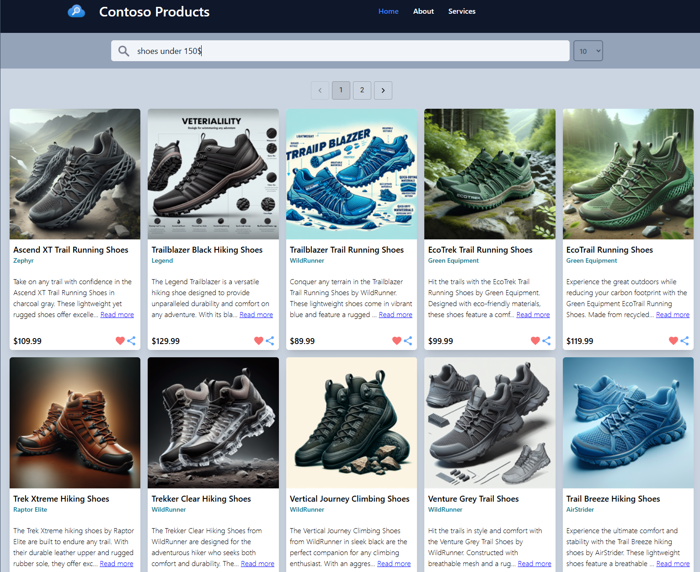
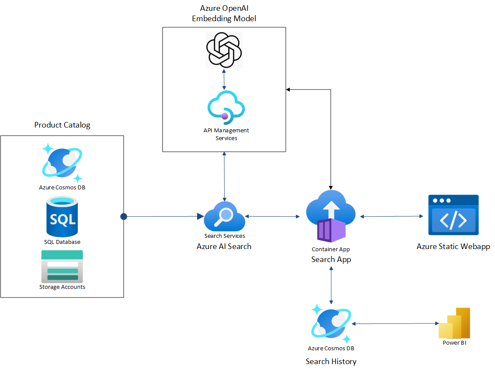

# e-Retail-AI-Enhanced-Search

## Table of Contents

- [Introduction](#introduction)
- [User Experience](#user-experience)
- [Solution Architecture](#solution-architecture)
- [Key Components](#key-components)
- [Getting Started](#getting-started)
  - [Pre-requisites](#prerequisites)
- [Solution Guide](#solution-detailed-guide)
- [Security Considerations](#security-considerations-and-guidelines)
- [Responsible AI](#responsible-ai)

## Introduction

Highly relevant product discovery by its consumers is critical for any retailer (direct or indirect). This is the first step to drive sales (their top line), as product discovery converts into a sale through multiple channels, offers, promotions etc.

Every major retail store has an online presence in the e-retail space, through their own portals or through other e-retail collaborations, where their consumers can search for products, browse through catalogs etc.

Advent of GenAI LLM is revolutionizing the way product search and discovery works. Powerful LLMs identify a consumer’s intent with higher accuracy resulting in highly relevant search results. Over the past years, several customers have started incorporating AI enhanced search, either through existing search engines or building interactive chatbots.

The following extract from an [IDC Research Report](https://www.idc.com/getdoc.jsp?containerId=US51940624&pageType=PRINTFRIENDLY) describes the use-case in detail.

 

## User Experience

Product discovery is a crucial aspect of the e-retail experience, enabling shoppers to find the items they are looking for and exposing them to new products they may want. Effective product discovery can significantly enhance customer satisfaction, increase conversion rates, and boost customer loyalty.

- Key Elements of Product Discovery:Search Functionality: Advanced search features, including text and visual search, help customers find products quickly and accurately.
- Personalized Recommendations: Using data analytics, retailers can offer personalized product recommendations based on individual customer preferences and behavior's.
- Navigation and Filters: Well-organized navigation and filtering options make it easier for customers to browse and discover products.
- Product Catalogue Enrichment: With LLM model, E-retailer can enrich their product catalogue for search accuracy and increasing semantic relevance.

Overall, the e-retail industry is rapidly evolving, with product discovery playing a pivotal role in shaping the online shopping experience. Retailers must continuously innovate and adapt to meet the changing needs of consumers.

## Solution Architecture

|  |
| ---- |

## Key Components

Components of the solution are as follows:

- **Azure Cosmos DB** - A globally distributed database service. It is well suited for low latency applications. This will be used to store product catalog information and search history.
- **AI Search** - A cloud solution that provides a rich search experience with key word and vector store capabilities over private, heterogeneous content in web, mobile, and enterprise applications. This will be used for vector search functionality.
- **Azure App Service** - Web Apps hosts web applications allowing auto scale and high availability without having to manage infrastructure. This will be used as a web-front-end interface.
- **Azure OpenAI Service** provides REST API access to OpenAI's powerful language models including Embeddings model series. Users can access the service through REST APIs, Python SDK, or our web-based interface in the Azure OpenAI Studio.  This will be used for embedding functionality.
- **Azure Functions** is a serverless solution that makes it possible for you to write less code, maintain less infrastructure, and save on costs.This is used for handling incoming requests.
- **Azure Content Safety** is a service that helps you detect and filter harmful user-generated and AI-generated content in your applications and services. Content Safety includes text and image detection to find content that is offensive, risky, or undesirable, such as profanity, adult content, gore, violence, hate speech, and more. This will be used to implement responsible generative AI measures.

## Getting Started

This repo assumes you are familiar with the basics of Generative AI and Integrated Vector databases. None the less its good if you refer the [Key Concepts to Understand](./docs/00_Concepts.md) section prior to deployment.

### Prerequisites

You need the following to be able to deploy the solution:

- Azure Subscription : Ideally use a dedicated Azure subscription, where you have submitted the subscription ID into the form for [requesting access to Azure OpenAI](https://customervoice.microsoft.com/Pages/ResponsePage.aspx?id=v4j5cvGGr0GRqy180BHbR7en2Ais5pxKtso_Pz4b1_xUOFA5Qk1UWDRBMjg0WFhPMkIzTzhKQ1dWNyQlQCN0PWcu). This will ensure that the subscription is enabled for Azure OpenAI, including GTP-4.
- The user who's deploying the reference implementation must be Owner of the subscription, as the deployment will be making role assignments for the managed identities that are created for the Azure services.
- [Azure PowerShell](https://docs.microsoft.com/powershell/azure/install-az-ps)
- Bash shell
- [Git](https://git-scm.com/downloads)
- [Azure CLI](https://docs.microsoft.com/cli/azure/install-azure-cli)
- [VS Code](https://code.visualstudio.com/download)
- [Node.js](https://nodejs.org/en/download/package-manager)
- [Dotnet 8.0 Core](https://dotnet.microsoft.com/download)

## Solution Detailed Guide 

Its good to navigate to the [Solution Guide](/docs/02_Solution_Guide.md) which helps you understand how the components are created and interconnected with each other. Most of the steps are automated. For POC we highly recommend using the same sample dataset till the dependencies are understood and then go for customization if needed.

## Solution Quickstart

You can follow step by step guide in the [Quickstart Guide](./docs/03_Solution_Quickstart.md) document to deploy the solution for both POC or PROD intent. It provides screenshots of the various section of the deployment template and variables required for the flow. This in turn invokes the corresponding **Bicep Template** responsible for creating the infrastructure resources.

## Security Considerations and Guidelines

Security is a key aspect of any solution. The [Security Considerations](./docs/04_Security_Guide.md) document provides a detailed explanation of the security aspects of the solution. Securing the various AI Architecture Layer **[AI platform,AI application,AI usage]**
is a shared responsibility between customers and Microsoft.

## Responsible AI

The 6 guiding principles of responsible AI are :

1. **Fairness** : How might an AI system allocate opportunities, resources, or information in ways that are fair to the humans who use it?
2. **Reliability & safety** : How might the system function well for people across different use conditions and contexts, including ones it was not originally intended for?
3. **Privacy & security** : How might the system be designed to support privacy and security?
4. **Inclusiveness** : How might the system be designed to be inclusive of people of all abilities?
5. **Transparency** : How might people misunderstand, misuse, or incorrectly estimate the capabilities of the system?
6. **Accountability** : How can we create oversight so that humans can be accountable and in control?

Here is a video link[to explore Responsible Generative AI](https://learn.microsoft.com/shows/on-demand-instructor-led-training-series/generative-ai-module-3/)

To help make your experience of AI positive and human-centered, Microsoft has established guidelines for human-AI interactions.The guidelines are grouped into four categories.

> :memo: **Note:**Learn more: https://aka.ms/aiguidelines. 

You can leverage the existing [tools and processes](https://www.microsoft.com/ai/tools-practices) to incorporate Responsible AI in your workloads

## AI Design Workshop

You can also avail [workshops](https://azuremarketplace.microsoft.com/marketplace/consulting-services/category/ai-plus-machine-learning?page=1&filters=workshop) 

## Contributing

This project welcomes contributions and suggestions.  Most contributions require you to agree to a
Contributor License Agreement (CLA) declaring that you have the right to, and actually do, grant us
the rights to use your contribution. For details, visit https://cla.opensource.microsoft.com.

When you submit a pull request, a CLA bot will automatically determine whether you need to provide
a CLA and decorate the PR appropriately (e.g., status check, comment). Simply follow the instructions
provided by the bot. You will only need to do this once across all repos using our CLA.

This project has adopted the [Microsoft Open Source Code of Conduct](https://opensource.microsoft.com/codeofconduct/).
For more information see the [Code of Conduct FAQ](https://opensource.microsoft.com/codeofconduct/faq/) or
contact [opencode@microsoft.com](mailto:opencode@microsoft.com) with any additional questions or comments.

## Other Resources

- [Azure Cosmos DB - Database for the AI Era](https://learn.microsoft.com/en-us/azure/cosmos-db/introduction)
- [Understand embeddings in Azure OpenAI Service](https://learn.microsoft.com/en-us/azure/openai-service/understand-embeddings)
- [Vectors in Azure AI Search](https://learn.microsoft.com/en-us/azure/search/vector-search-concept-intro)
- [Integrated data chunking and embedding in Azure AI Search](https://learn.microsoft.com/en-us/azure/search/vector-search-integrated-vectorization)
- [Semantic ranking in Azure AI Search](https://learn.microsoft.com/en-us/azure/search/semantic-ranking-intro)
- [AI enrichment in Azure AI Search](https://learn.microsoft.com/en-us/azure/search/cognitive-search-concept-intro)
- [Skillset concepts in Azure AI Search](https://learn.microsoft.com/en-us/azure/search/cognitive-search-concept-skillset)
