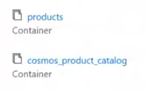

# Overview

## Workflow

The infrastructure components get deployed with a **Bicep template**.
The **backend web API's** are in **.NET code** which run in the container app. This gets created with secrets which get auto-populated during deployment through the Bicep template.

The spa folder contains the **frontend React code**. This runs as a **static web application**. It has an API connection to the container app. No image search functionality

The CosmosDB **Product** database gets created with a sample of 100 files and random images.
There is a **Product Catalog** inside the **Product** database. 

The AI search components consists of **Index** that searches the cosmosDB for certain fields and a Semantic configuration for generic searches. 

|| |
| ------ | ---- |

There is also the **Indexer** which shows the date when the CosmosDB was indexed.

|| |
| ------ | ---- |

**APIM** is public facing. The frontend is reactive in its layout. Furthermore it has paging and filters which let's you perform key value search. It can also cater to interactive search.

