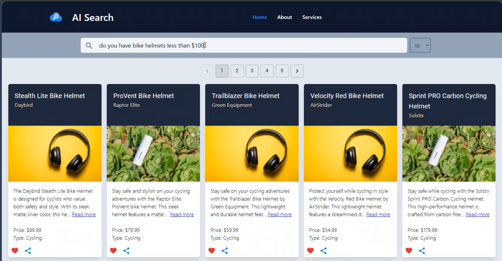

# Overview

Under the SRC folder you will find **[api](../src/api/)** and **[data](../src/data/)** which contains the application and data code. The repo uses the [products.csv](../data/AzureSearch/data/products.csv) as sample data. It looks as follows

Using this sample data a search index is created on the following fields

Based on the above structure various fields are called to integrate filtering, sorting, vectorization capabilities and dedicate how the search results will look like. This is done using [Search Index](https://learn.microsoft.com/azure/search/search-what-is-an-index), [Indexer](https://learn.microsoft.com/azure/search/search-indexer-overview) & [Vector Store](https://learn.microsoft.com/azure/search/vector-store)capabilities of Azure AI Search.

These configurations get called in the [createIndex.py](/src/data/AzureSearch/createIndex.py)
It creates the following resources
1) A Cosmos Endpoint
2) A Cosmos Database
3) An Azure Client ID
4) An Azure Search Endpoint
5) A Cosmos Connection String
6) An Open AI Endpoint
7) An Open AI Embedding Deployment

All of these are executed using a default Azure credential from Azure Identity. It first creates a Cosmos container, database and a database partition key(In this sample the **id** field is used).

> :bulb: **Tip:** If configured through same sample set the result should print the following :
"Getting Database: catalogDB", "Getting client for container: products"

The CosmosDB **catalogDb** database gets created with a sample of 101 files and random images.
This resides under the **products** container within Cosmos DB. Cosmos DB version azure-cosmos==4.7.0

## Workflow

The infrastructure components get deployed with a **Bicep template**.
The **backend web API's** are in **.NET code** which run in the container app. This gets created with secrets which get auto-populated during deployment through the Bicep template.

The spa folder contains the **frontend React code**. This runs as a **static web application**. It has an API connection to the container app. No image search functionality

The AI search components consists of **Index** that searches the cosmosDB for certain fields and a Semantic configuration for generic searches. 

|| |
| ------ | ---- |

There is also the **Indexer** which shows the date when the CosmosDB was indexed.

|| |
| ------ | ---- |

**APIM** is public facing. The frontend is reactive in its layout. Furthermore it has paging and filters which let's you perform key value search. It can also cater to interactive search.

