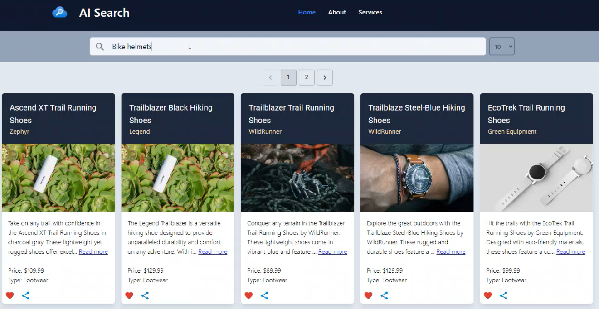

# Overview

Under the SRC folder you will find **[api](../src/api/)** and **[data](../src/data/)** which contains the application and data code. The repo uses the [products.csv](../data/AzureSearch/data/products.csv) as sample data. It looks as follows

Using this sample data a search index is created on the following fields

The CosmosDB **catalogDb** database gets created with a sample of 101 files and random images.
This resides under the **products** container within Cosmos DB. Cosmos DB version azure-cosmos==4.7.0

## Workflow

The infrastructure components get deployed with a **Bicep template**.
The **backend web API's** are in **.NET code** which run in the container app. This gets created with secrets which get auto-populated during deployment through the Bicep template.

The spa folder contains the **frontend React code**. This runs as a **static web application**. It has an API connection to the container app. No image search functionality

The AI search components consists of **Index** that searches the cosmosDB for certain fields and a Semantic configuration for generic searches. 

|| |
| ------ | ---- |

There is also the **Indexer** which shows the date when the CosmosDB was indexed.

|| |
| ------ | ---- |

**APIM** is public facing. The frontend is reactive in its layout. Furthermore it has paging and filters which let's you perform key value search. It can also cater to interactive search.

