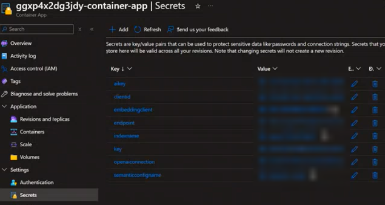

# Overview

## Workflow

The infrastructure components get deployed with a **Bicep template**.
The **backend web API's** are in **.NET code** which run in the container app. This gets created with secrets which get auto-populated during deployment through the Bicep template.

The spa folder contains the **frontend React code**.

The CosmosDB database gets created with a sample of 100 files and random images