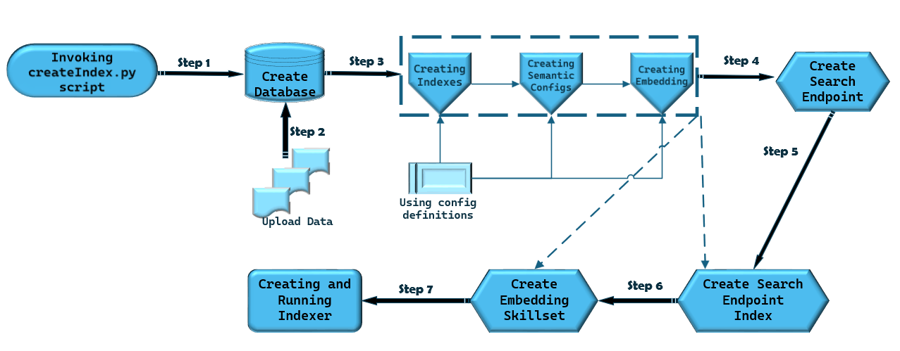
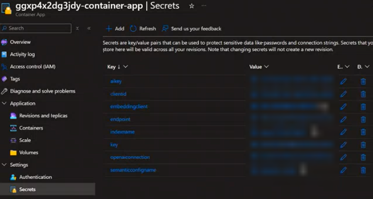
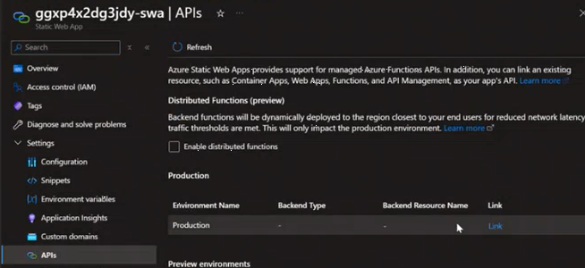
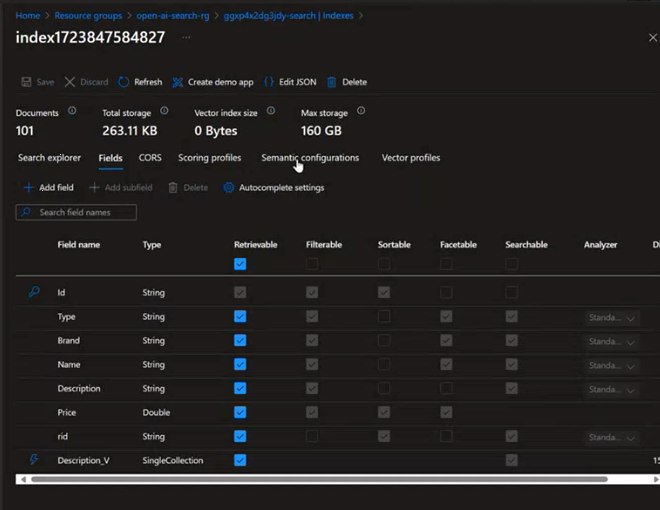
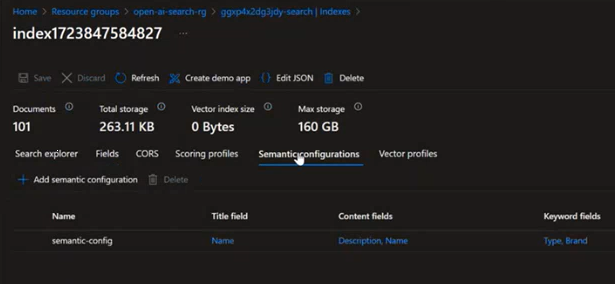
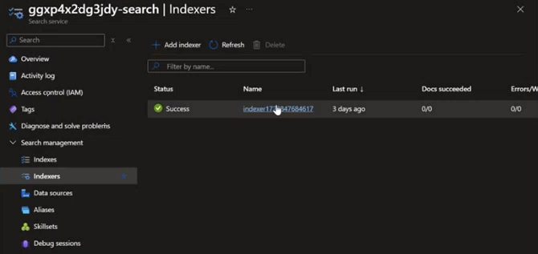
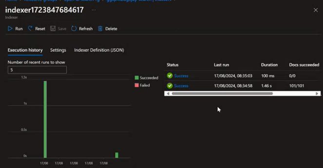
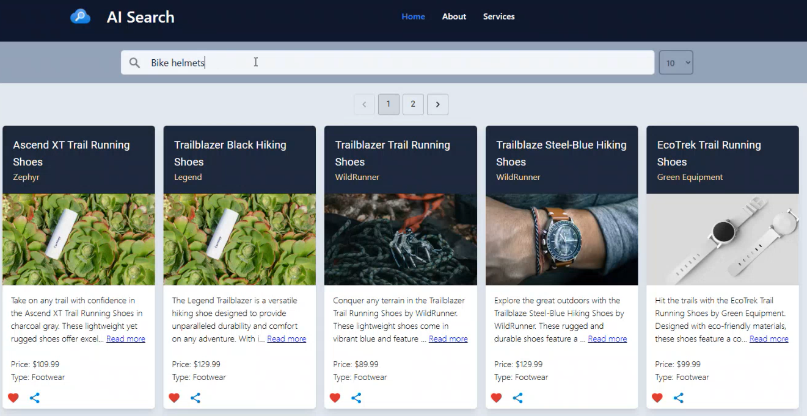
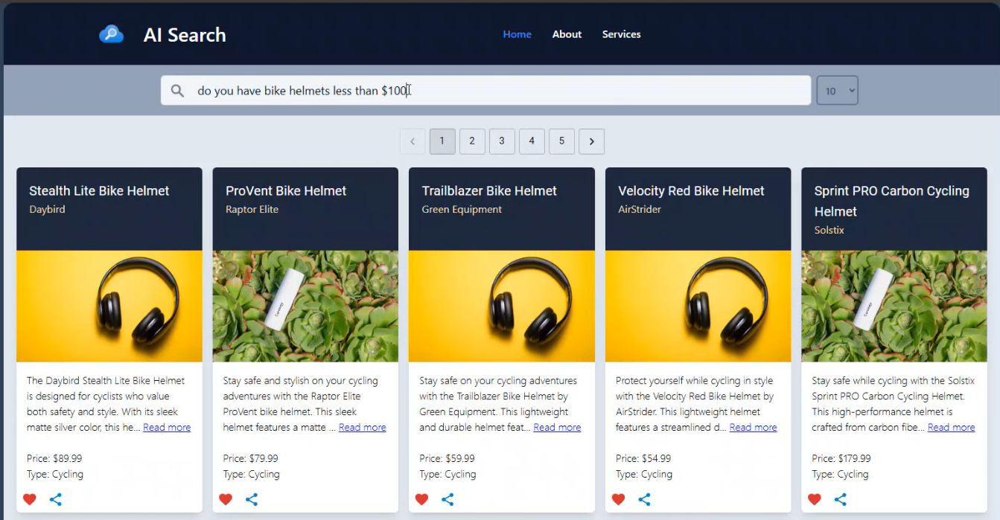

# Overview

Under the SRC folder you will find **[api](../src/api/)** , **[spa](../src/spa/)** and **[data](../src/data/)** which contains the application and data code. These contain the logic for Backend and Frontend services used to create the Retail AI Search deployment.

## Table of Contents

- [Backend Flow](#backend-flow---cosmos-db-azure-search-and-open-ai-components)
  - [Customizable Options](#customizable-options)
  - [RBAC Permissions](#rbac-permissions)

## Backend Flow - Cosmos DB, Azure Search and Open AI Components

Here we are going to focus mainly on **[data](../src/data/)** folder. The **[requirements.txt](../src/data/requirements.txt)** contain some pre-requisite information. We have two configurations files here

### .env file

- **COSMOS_ENDPOINT**="<https://XXXXXXXXXXXXXX-cosmosdb.documents.azure.com/>"
- **COSMOS_DATABASE**="catalogDb" - The name of the database in Cosmos DB
- **AZURE_SEARCH_ENDPOINT**="<https://XXXXXX-search1.search.windows.net>"
- **COSMOS_DB_CONNECTION_STRING**="ResourceId=/subscriptions/XXXXX/resourceGroups/XXXXXXXXXXXXXX/providers/Microsoft.DocumentDB/databaseAccounts/XXXXXX;Database=catalogDb;IdentityAuthType=AccessToken"
- **OPEN_AI_ENDPOINT**="<https://XXXXXX-openai.openai.azure.com/>"
- **OPEN_AI_EMBEDDING_DEPLOYMENT_NAME** = "embedding" - the deployment name of the Open AI Embedding model
- **AZURE_CLIENT_ID**="" - The user managed identity of the Azure agent who is running the script ( E.g. VM or Azure container app job). If we are running the script in the local environment, we can leave it blank.

### Search Config

`AzureSearch\config\config.json`

- **Cosmos config** : this portion contains the cosmos db configurations like cosmos db name, container name, partition key, and the fields which we want to index.
- **Search config** : This portion contains the Azure AI Search configurations like search service name, index name, indexer name, skillset name, and the fields which we want to index.
- **Open AI config** : This portion contains the Open AI configurations like open ai endpoint, model deployment name.

The repo uses the [products.csv](../data/AzureSearch/data/products.csv) as sample data. It looks as follows

Using this sample data a search index is created on the following fields

Based on the above structure various fields are called to integrate filtering, sorting, vectorization capabilities and dedicate how the search results will look like. This is done using [Search Index](https://learn.microsoft.com/azure/search/search-what-is-an-index), [Indexer](https://learn.microsoft.com/azure/search/search-indexer-overview) & [Vector Store](https://learn.microsoft.com/azure/search/vector-store)capabilities of Azure AI Search. This is leveraged for creating an [Open AI Embedding](https://learn.microsoft.com/azure/search/cognitive-search-skill-azure-openai-embedding)

These configurations get called in the [createIndex.py](/src/data/AzureSearch/createIndex.py)
It creates the following resources

1) A Cosmos Endpoint
2) A Cosmos Database with partitioned data
3) A Cosmos Connection String with default Azure Credentials
4) An Azure Search Endpoint
5) An Azure AI Search Index
6) An Open AI Endpoint
7) An Open AI Embedding Skillset
8) A One-time Run of Indexer

The code is executed using a [Default Azure Credential](https://learn.microsoft.com/python/api/azure-identity/azure.identity.defaultazurecredential?view=azure-python) from Azure Identity.

Based on the environment you are deploying please refer to the [POC Environment] & [Prod Environment] guides accordingly. They contains specific sections to modify the front end API calls and backend data sources.

### Customizable Options

$${\color{blue} FOR POC}$$

**Azure CosmosDB**
We recommend you to leverage the same sample data provided under the data folder at least once so as to get the hang of the flow. In the script we are setting the "dataChangeDetectionPolicy" property in your data source definition. This is done to enable [incremental indexing](https://learn.microsoft.com/azure/search/search-howto-index-cosmosdb#indexing-new-and-changed-documents). The property tells the indexer which change tracking mechanism is used on your data.

- For Azure Cosmos DB indexers, the only supported policy is the "HighWaterMarkChangeDetectionPolicy" using the “_ts (timestamp)” property provided by Azure Cosmos DB.

However you can also choose to place the [products.csv](../data/AzureSearch/data/products.csv) inside Azure SQL (when working with structured data) or Storage Account (when working with unstructured data).

**Azure SQL**
When using Azure SQL provided change tracking is enabled, a search indexer can pick up just the new and updated content on subsequent indexer runs. [To enable incremental indexing](https://learn.microsoft.com/azure/search/search-howto-connecting-azure-sql-database-to-azure-search-using-indexers#CaptureChangedRows), set the "dataChangeDetectionPolicy" property in your data source definition. This property tells the indexer which change tracking mechanism is used on your table or view.
For Azure SQL indexers, there are two change detection policies:

- "SqlIntegratedChangeTrackingPolicy" (applies to tables only)
- "HighWaterMarkChangeDetectionPolicy" (works for tables and views)

**Storage Account**
For indexed content that originates from Azure Storage, change detection occurs automatically because indexers keep track of the last update using the built-in timestamps on objects and files in Azure Storage.After an initial search index is created, you might want subsequent [indexer jobs to only pick up new and changed documents](https://learn.microsoft.com/azure/search/search-howto-index-changed-deleted-blobs?tabs=portal). You may also choose to enable soft delete strategy to remove outdated content.
There are two ways to implement a soft delete strategy:

- [Native blob soft delete, applies to Blob Storage only](https://learn.microsoft.com/azure/search/search-howto-index-changed-deleted-blobs?tabs=portal#configure-native-soft-delete)
- [Soft delete using custom metadata](https://learn.microsoft.com/azure/search/search-howto-index-changed-deleted-blobs?tabs=portal#soft-delete-strategy-using-custom-metadata)

> :memo: **Note:**
Modifying the source for data or content of data might need the implementor to manually take care of the dependencies in the config.json file and createIndex.py file. The images shown earlier reflect the fields to consider in config.json file. The createIndex.py file will have to be modified at various locations pointing to the right source and definitions. The Search & OpenAI endpoints for client will also change accordingly.

### RBAC Permissions

### Network Considerations

## Frontend Flow - Cosmos DB, Azure Search and Open AI Components
<!---
### Step 1
It first creates a Cosmos container, database and a database partition key(In this sample the **id** field is used).
> :bulb: **Tip:** Sample dataset should print the following result:
"Getting Database: catalogDB", "Getting client for container: products"

### Step 2
It then uploads the data in the CSV file to the newly created Cosmos database.
> :bulb: **Tip:**  Sample dataset should print the following result:
"Uploading Data...", "Inserting product ID: {each product ID should get displayed here} to Cosmos DB","Product {each product ID should get displayed here} uploaded to Cosmos DB". It will iterate through all 101 items in the CSV file

### Step 3
The Index definition is created based on the fields mentioned in the config.json file. We also set variables required for [Vectorizer](https://learn.microsoft.com/azure/search/vector-search-how-to-configure-vectorizer) and [Semantic Configurations](https://learn.microsoft.com/azure/search/semantic-how-to-configure?tabs=portal) based on the configurations mentioned in the config file.
> :bulb: **Tip:**  Sample dataset should print the following result:
"Setting Indexer Variables..."

### Step 4
A service endpoint is created pointing the database container name. It uses the [search service managed identity connection string](https://learn.microsoft.com/azure/search/search-howto-index-cosmosdb#supported-credentials-and-connection-strings) to connect to CosmosDB
> :bulb: **Tip:**  Sample dataset should print the following result:
"Creating Search Client with Endpoint: <endpointname>", "Data Source created successfully."

### Step 5
Here is where we leverage te variables set in Step 4 and create the AI [Search Index](https://learn.microsoft.com/azure/search/search-what-is-an-index). 
> :bulb: **Tip:**  Sample dataset should print the following result:
"Search Index created successfully"

### Step 6
OpenAI’s text embeddings measure the relatedness of text strings. Embeddings are commonly used for:

- **Search** (where results are ranked by relevance to a query string)
- **Clustering** (where text strings are grouped by similarity)
- **Recommendations** (where items with related text strings are recommended)
- **Anomaly detection** (where outliers with little relatedness are identified)
- **Diversity measurement** (where similarity distributions are analyzed)
- **Classification** (where text strings are classified by their most similar label)
In this step we configure the [OpenAI Embedding Skillset](https://learn.microsoft.com/azure/search/cognitive-search-skill-azure-openai-embedding).

> :bulb: **Tip:**  Sample dataset should print the following result:
"Creating OpenAI Embedding Skillset","Creating the Skillset", "Skillset created successfully"

### Step 7
Finally we create the [Indexer](https://learn.microsoft.com/azure/search/search-indexer-overview) and run it.The indexer is used to scan the data from the Cosmos DB and push the data to the Azure AI Search Index.
> :bulb: **Tip:**  Sample dataset should print the following result:
"Creating the indexer.", "Indexer created successfully."
On an initial run, when the index is empty, an indexer will read in all of the data provided in the table or container. On subsequent runs, the indexer can usually detect and retrieve just the data that has changed. Since we are using Azure CosmosDB we have already enabled the change detection. This is to enable the different stages of indexing.

## Workflow

The CosmosDB **catalogDb** database gets created with a sample of 101 files and random images.
This resides under the **products** container within Cosmos DB. Cosmos DB version azure-cosmos==4.7.0

The infrastructure components get deployed with a **Bicep template**.
The **backend web API's** are in **.NET code** which run in the container app. This gets created with secrets which get auto-populated during deployment through the Bicep template.

The spa folder contains the **frontend React code**. This runs as a **static web application**. It has an API connection to the container app. No image search functionality

The AI search components consists of **Index** that searches the cosmosDB for certain fields and a Semantic configuration for generic searches. 

|| |
| ------ | ---- |

There is also the **Indexer** which shows the date when the CosmosDB was indexed.

|| |
| ------ | ---- |

**APIM** is public facing. The frontend is reactive in its layout. Furthermore it has paging and filters which let's you perform key value search. It can also cater to interactive search.

-->