# Overview

Under the SRC folder you will find **[api](../src/api/)** , **[spa](../src/spa/)** and **[data](../src/data/)** which contains the application and data code. These contain the logic for Backend and Frontend services used to create the Retail AI Search deployment.

## Table of Contents

- [Backend Flow](#backend-flow---cosmos-db-azure-search-components-and-open-ai-components)
  - [Customizable options](#customizable-options)
  - [RBAC permissions](#rbac-permissions)
  - [Network considerations](#network-considerations)
- [Frontend Flow](#frontend-flow---ai-search-service-storage-accounts-container-apps-network)
  - [Network approvals](#network-approvals)
  - [Container Environment](#container-environment)
      1. [Data Ingestion Job](#data-ingestion-job)
      1. [Static WebApp Creation Job](#static-webapp-creation-job)
  - [Customizable Options](#customizable-options-for-website)
  - [RBAC permissions](#rbac-permissions-for-container-environment)
 
## Backend Flow - Cosmos DB, Azure Search Components and Open AI Components

Here we are going to focus mainly on **[data](../src/data/)** folder. The **[requirements.txt](../src/data/requirements.txt)** contain some pre-requisite information. We have two configurations files here

### .env file

- **COSMOS_ENDPOINT**="<https://XXXXXXXXXXXXXX-cosmosdb.documents.azure.com/>"
- **COSMOS_DATABASE**="catalogDb" - The name of the database in Cosmos DB
- **AZURE_SEARCH_ENDPOINT**="<https://XXXXXX-search1.search.windows.net>"
- **COSMOS_DB_CONNECTION_STRING**="ResourceId=/subscriptions/XXXXX/resourceGroups/XXXXXXXXXXXXXX/providers/Microsoft.DocumentDB/databaseAccounts/XXXXXX;Database=catalogDb;IdentityAuthType=AccessToken"
- **OPEN_AI_ENDPOINT**="<https://XXXXXX-openai.openai.azure.com/>"
- **OPEN_AI_EMBEDDING_DEPLOYMENT_NAME** = "embedding" - the deployment name of the Open AI Embedding model
- **AZURE_CLIENT_ID**="" - The user managed identity of the Azure agent who is running the script ( E.g. VM or Azure container app job). If we are running the script in the local environment, we can leave it blank.

### Search Config

`AzureSearch\config\config.json`

- **Cosmos config** : this portion contains the cosmos db configurations like cosmos db name, container name, partition key, and the fields which we want to index.
- **Search config** : This portion contains the Azure AI Search configurations like search service name, index name, indexer name, skillset name, and the fields which we want to index.
- **Open AI config** : This portion contains the Open AI configurations like open ai endpoint, model deployment name.

The repo uses the [products.csv](../data/AzureSearch/data/products.csv) as sample data. It looks as follows

Using this sample data a search index is created on the following fields

Based on the above structure various fields are called to integrate filtering, sorting, vectorization capabilities and dedicate how the search results will look like. This is done using [Search Index](https://learn.microsoft.com/azure/search/search-what-is-an-index), [Indexer](https://learn.microsoft.com/azure/search/search-indexer-overview) & [Vector Store](https://learn.microsoft.com/azure/search/vector-store)capabilities of Azure AI Search. This is leveraged for creating an [Open AI Embedding](https://learn.microsoft.com/azure/search/cognitive-search-skill-azure-openai-embedding)

These configurations get called in the [createIndex.py](/src/data/AzureSearch/createIndex.py)
It creates the following resources

1) A Cosmos Endpoint
2) A Cosmos Database with partitioned data
3) A Cosmos Connection String with default Azure Credentials
4) An Azure Search Endpoint
5) An Azure AI Search Index
6) An Open AI Endpoint
7) An Open AI Embedding Skillset
8) A One-time Run of Indexer

The code is executed using a [Default Azure Credential](https://learn.microsoft.com/python/api/azure-identity/azure.identity.defaultazurecredential?view=azure-python) from Azure Identity.Refer [this document](/docs/02_a_BackendStepbyStep.md) which explains the whole script step-by-step. The diagram below depicts the steps at a high-level.

Based on the environment you are deploying please refer to the [POC Environment] & [Prod Environment] guides accordingly.

## Customizable Options

> :warning: Tip : We recommend you to leverage the same sample data provided under the data folder at least once so as to get the hang of the flow.

$${\color{blue} FOR POC}$$

**Azure CosmosDB**
 In the script we are setting the "dataChangeDetectionPolicy" property in your data source definition. This is done to enable [incremental indexing](https://learn.microsoft.com/azure/search/search-howto-index-cosmosdb#indexing-new-and-changed-documents). The property tells the indexer which change tracking mechanism is used on your data.

- For Azure Cosmos DB indexers, the only supported policy is the "HighWaterMarkChangeDetectionPolicy" using the “_ts (timestamp)” property provided by Azure Cosmos DB.

However you can also choose to place the [products.csv](../data/AzureSearch/data/products.csv) inside Azure SQL (when working with structured data) or Storage Account (when working with unstructured data).

> :memo: **Note:**
Modifying the source for data or content of data might need the implementor to manually take care of the dependencies in the config.json file and createIndex.py file. The images shown earlier reflect the fields to consider in config.json file. The createIndex.py file will have to be modified at various locations pointing to the right source and definitions. The Search & OpenAI endpoints for client will also change accordingly.

**Azure SQL**
When using Azure SQL provided change tracking is enabled, a search indexer can pick up just the new and updated content on subsequent indexer runs. [To enable incremental indexing](https://learn.microsoft.com/azure/search/search-howto-connecting-azure-sql-database-to-azure-search-using-indexers#CaptureChangedRows), set the "dataChangeDetectionPolicy" property in your data source definition. This property tells the indexer which change tracking mechanism is used on your table or view.
For Azure SQL indexers, there are two change detection policies:

- "SqlIntegratedChangeTrackingPolicy" (applies to tables only)
- "HighWaterMarkChangeDetectionPolicy" (works for tables and views)

**Storage Account**
For indexed content that originates from Azure Storage, change detection occurs automatically because indexers keep track of the last update using the built-in timestamps on objects and files in Azure Storage.After an initial search index is created, you might want subsequent [indexer jobs to only pick up new and changed documents](https://learn.microsoft.com/azure/search/search-howto-index-changed-deleted-blobs?tabs=portal). You may also choose to enable soft delete strategy to remove outdated content.
There are two ways to implement a soft delete strategy:

- [Native blob soft delete, applies to Blob Storage only](https://learn.microsoft.com/azure/search/search-howto-index-changed-deleted-blobs?tabs=portal#configure-native-soft-delete)
- [Soft delete using custom metadata](https://learn.microsoft.com/azure/search/search-howto-index-changed-deleted-blobs?tabs=portal#soft-delete-strategy-using-custom-metadata)

## RBAC permissions

- **Cosmos DB**
  - [Cosmos DB Data Contributor Role](https://learn.microsoft.com/azure/cosmos-db/how-to-setup-rbac#built-in-role-definitions) : This access gets provided to the Container App Managed Identity to write data in CosmosDb and create indexes and search
    - [Cosmos DB Data Reader Role](https://learn.microsoft.com/azure/cosmos-db/how-to-setup-rbac#built-in-role-definitions) : This access gets provided to the Container
App Managed Identity to read the data in CosmosDB

## Network considerations

Please ignore this section if you the services in the public endpoint. If you are using the private endpoint for the network connectivity between the resources make sure that the below configurations are done.

1. You are using the Azure AI Search service with SKU Standard2 or above. This is required because we are using the AI Enrichment and skills in the Azure AI Search. [[details](https://learn.microsoft.com/azure/search/search-indexer-howto-access-private?tabs=portal-create#prerequisites)]
2. The private Link is created for the outbound connectivity from the Azure AI Search to the Cosmos DB, and Azure AI Search to the Azure Open AI Service. [[details](https://learn.microsoft.com/azure/search/search-indexer-howto-access-private?tabs=portal-create#supported-resource-types)]

## Frontend Flow - AI Search Service, Storage Accounts, Container Apps, Network

The arm template is responsible for creating the resources based on the selection made for "Intent to Deploy". The infrastructure components get deployed with a **Bicep template**. 
It creates the Log Analytics and Managed Identities. It also spins Container environment.Finally it creates a search service with Indexes and Indexers and Data source pointing to CosmosDB.

The index name and indexer name are hard-coded for POC

| 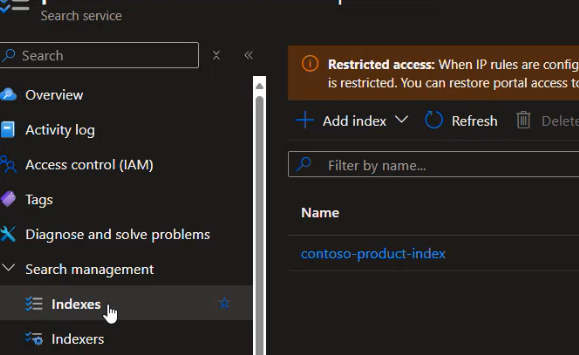 | 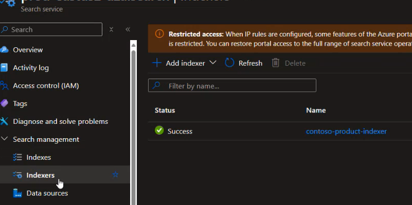|
| ----- | ------ |

It connects to the data source and uses skillset we created using the scripts in the Backend flow

| 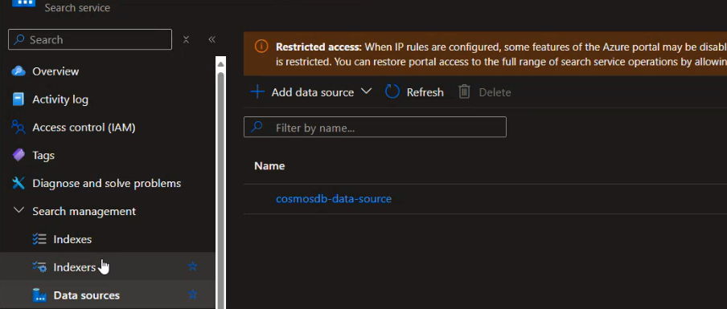 | 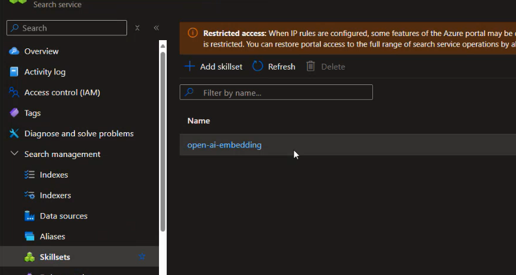|
| ----- | ------ |

### Network approvals

There are implicit calls from Azure AI Search to Azure Open AI [for skillset] and Azure AI Search to Azure CosmosDB [for indexer and indexing], both these calls happen over a private network using the shared private link access. The deployment scripts are responsible for creating the link but approval process is manual. For this you manually have to go to Azure AI Search service - > Network -> Shared Link Access -> Approve. Once approved the status would reflect as follows:

| 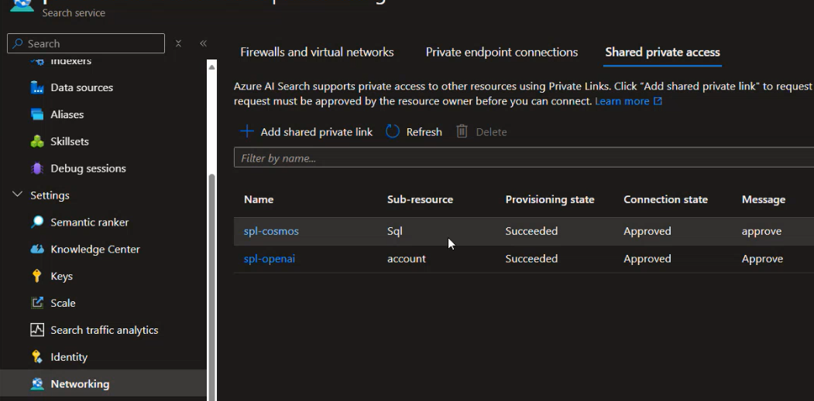 |
| ----- |

## Container Environment

A container apps environment is created hosting 3 container applications. One is the container app itself and the other 2 are container jobs. The container app gets created with the default secrets it needs to link to each of the backend component.

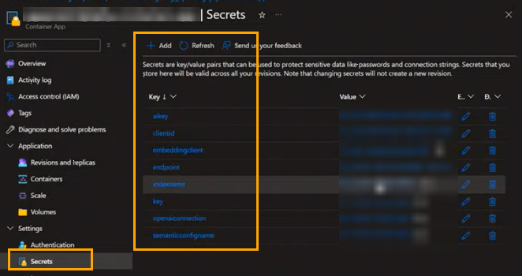

It gets created with the following environment variables which stick the FrontEnd to the Backend
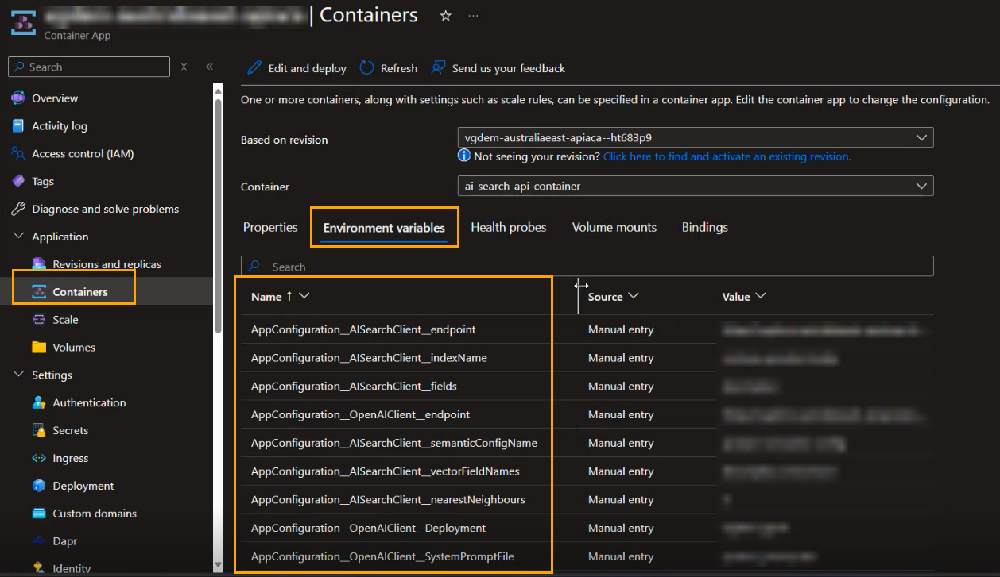

### **Data Ingestion Job**

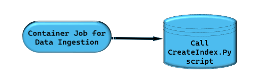

The first job is responsible for ingesting the data into CosmosDB calling the CreateIndex.py script for data ingestion. Once the network approvals is done manually go to the job and run it.

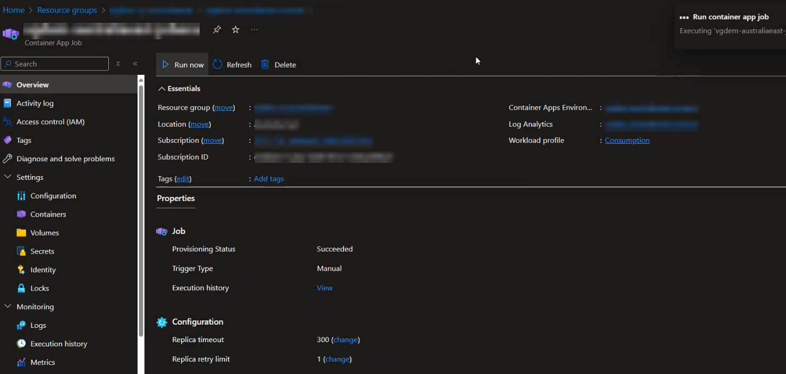

Usually it takes about a few seconds to succeed. Once succeeded you will be able to verify the loaded data navigating to the CosmosDB account -> Data Explorer

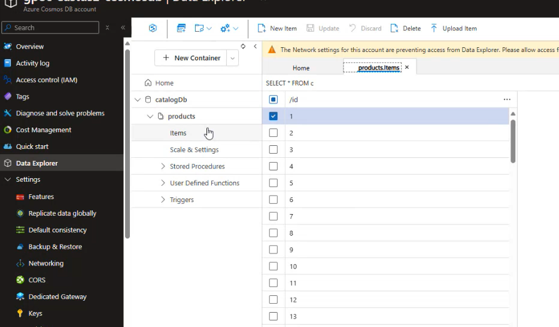

You should also be able to validate the AI Search Service reflecting an index created with random name and the indexer and the run for indexer

| |
| ----- | ----- |

| |
| ----- | ----- |

### **Static WebApp Creation Job**

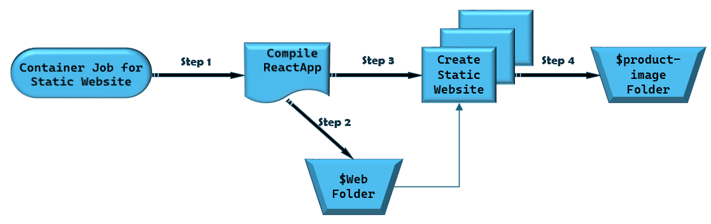

Web job basically runs following steps:

1. It executes the scripts to compile the React Web app  
2. It then upload the outputs of that compilation into that **$web** container for the storage account.

| 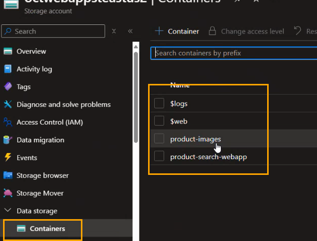 | 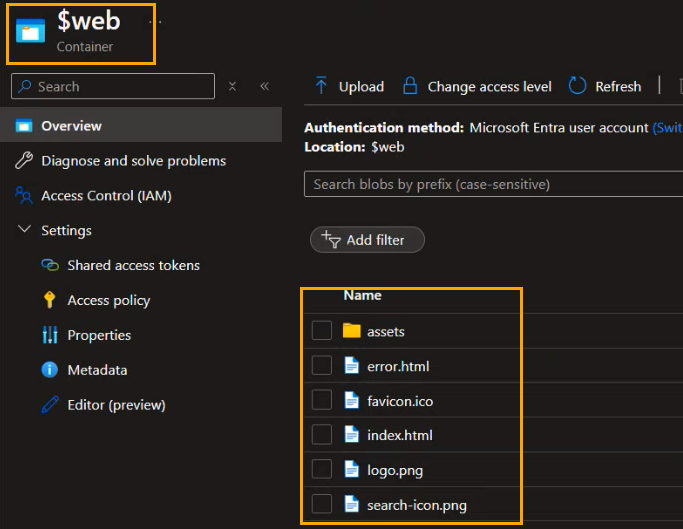 |
| ----- | ----- |

3. It enable static web apps on the storage container.
4. Finally it also upload the images into that pre created **product-images** container for the storage account.

|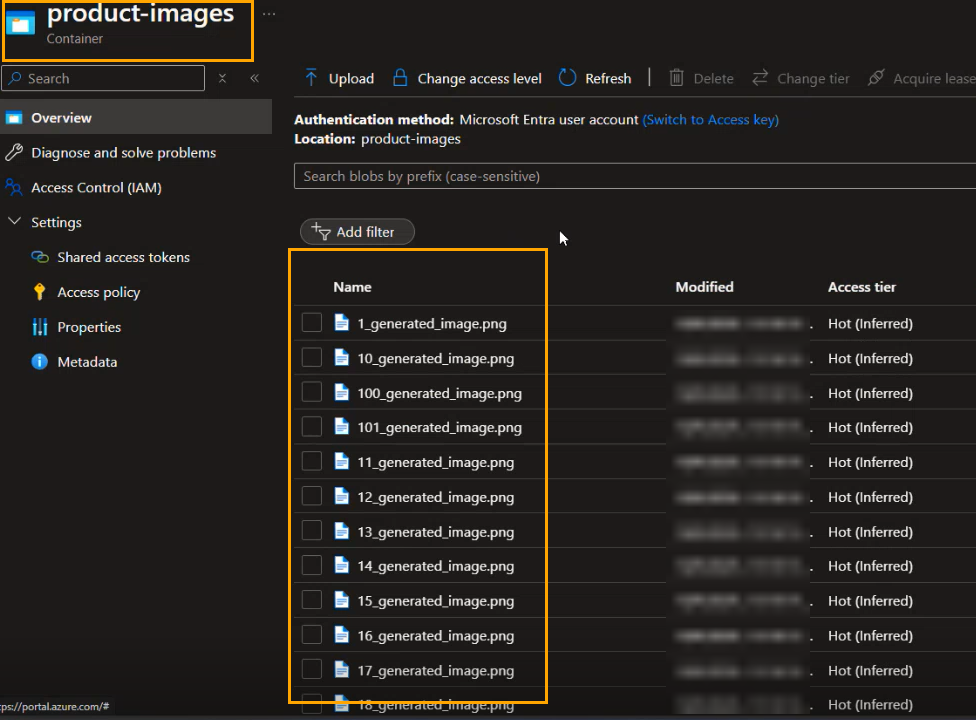 | 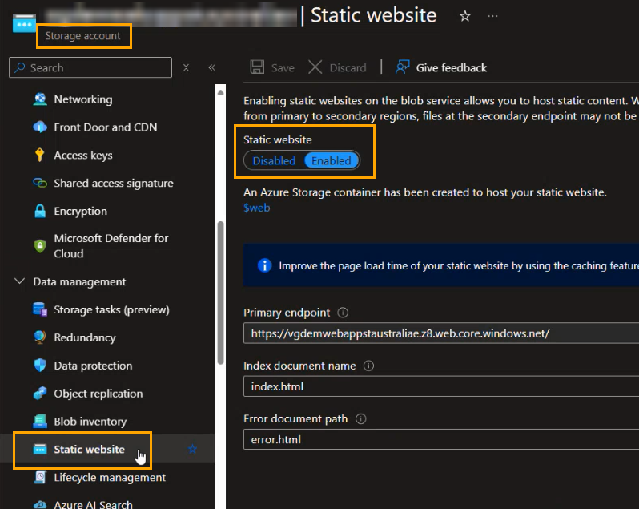 |
| ----- | ----- |

Refer [this document](/docs/02_b_FrontendStepbyStep.md) which explains the whole script step-by-step. The diagram below depicts the steps at a high-level.

## Customizable Options for Website

> :warning: Tip : We recommend you to leverage the same sample API's and React code provided under the API & SPA folders respectively at least once so as to get the hang of the flow. We recommend you not to change the context for POC at least however you are not restricted for the same.

$${\color{red} FOR PROD}$$

If you have your own container apps with custom data then you will have to come and change the environment variables below.

## RBAC permissions for Container Environment

### Container App itself

The container app itself needs the following permisisons : 

- [Search Index Data Reader](https://learn.microsoft.com/azure/role-based-access-control/built-in-roles/ai-machine-learning#search-index-data-reader): This enables the container app to read the data in the Azure Cognitive Search index. This is required to search the dataset leveraging index & vector fields.
- [Cognitive Services Open AI Contributor](https://learn.microsoft.com/azure/role-based-access-control/built-in-roles/ai-machine-learning#cognitive-services-openai-contributor): The container is making calls to the GPT 400 open AI model.

These permissions are auto-assigned when the POC intent is selected. You can verify the same by going to the container app -> Identity -> System Assigned -> Azure Role Assignments  
|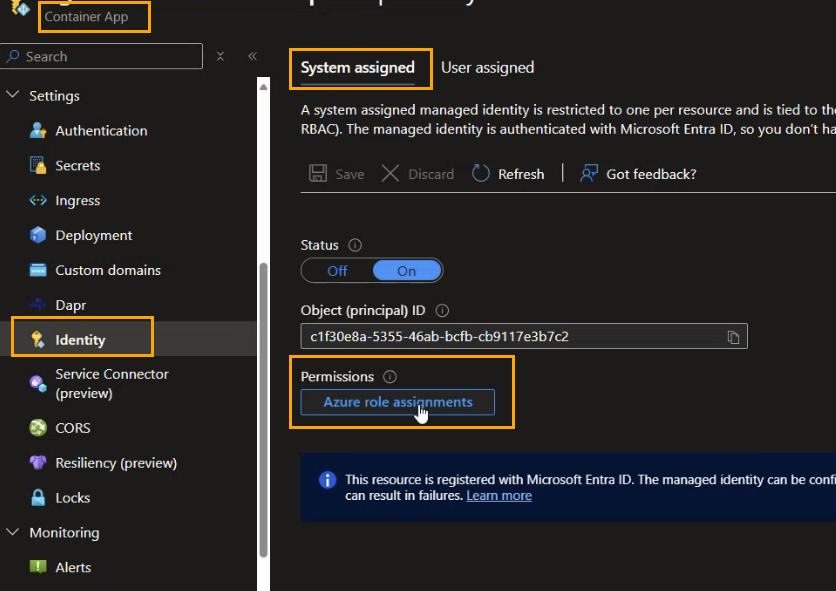 | 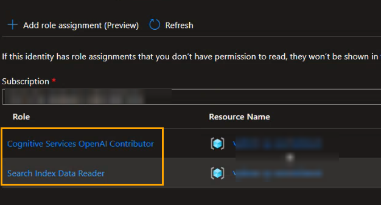 |
| ----- | ----- |

### Data Ingestion Job

Likewise the following permissions are assigned to the job which is responsible for ingesting data

- [Cosmos DB Data Reader Role](https://learn.microsoft.com/azure/cosmos-db/how-to-setup-rbac#built-in-role-definitions): This is required for the job to be able to read the data in the Cosmos DB account
- [ Search Service Contributor](https://learn.microsoft.com/azure/role-based-access-control/built-in-roles/ai-machine-learning#search-service-contributor): This is required for the job to be able to create index definitions, indexers, skillset and embedding.
<!---
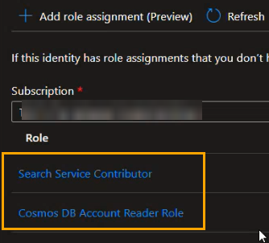
-->
### Static WebApp Creation Job

The static webapp creation job gets assigned the following permissions

- [Storage Account Contributor](https://learn.microsoft.com/azure/role-based-access-control/built-in-roles/storage#storage-account-contributor) : To be able to upload the content on the storage account.
- [Storage Blob Data Contributor](https://learn.microsoft.com/azure/role-based-access-control/built-in-roles/storage#storage-blob-data-contributor): To enable static website for the storage account.
<!---
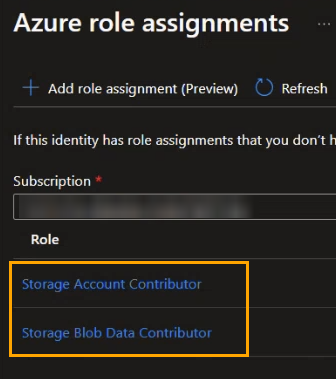
-->
