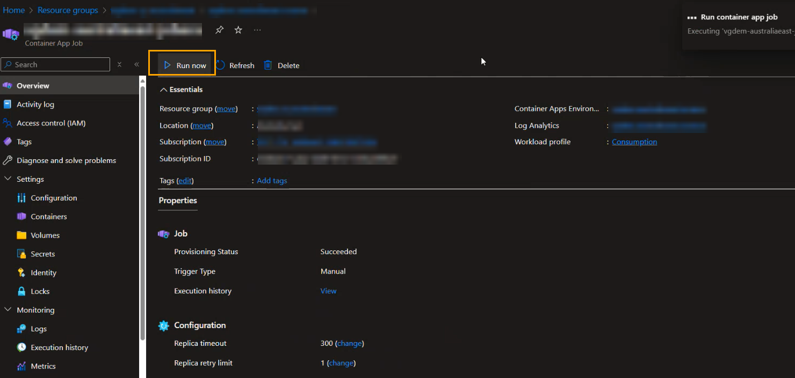

# Overview

Under the SRC folder you will find **[api](../src/api/)** , **[spa](../src/spa/)** and **[data](../src/data/)** which contains the application and data code. These contain the logic for Backend and Frontend services used to create the Retail AI Search deployment.

## Table of Contents

- [Backend Flow](#backend-flow---cosmos-db-azure-search-and-open-ai-components)
  - [Customizable options](#customizable-options)
  - [RBAC permissions](#rbac-permissions)
  - [Network considerations](#network-considerations)
- [Frontend Flow](#frontend-flow---ai-search-service-storage-accounts-container-apps-network)
  - [Network approvals](#network-approvals)
  - [Container Environment]()

  
## Backend Flow - Cosmos DB, Azure Search Components and Open AI Components

Here we are going to focus mainly on **[data](../src/data/)** folder. The **[requirements.txt](../src/data/requirements.txt)** contain some pre-requisite information. We have two configurations files here

### .env file

- **COSMOS_ENDPOINT**="<https://XXXXXXXXXXXXXX-cosmosdb.documents.azure.com/>"
- **COSMOS_DATABASE**="catalogDb" - The name of the database in Cosmos DB
- **AZURE_SEARCH_ENDPOINT**="<https://XXXXXX-search1.search.windows.net>"
- **COSMOS_DB_CONNECTION_STRING**="ResourceId=/subscriptions/XXXXX/resourceGroups/XXXXXXXXXXXXXX/providers/Microsoft.DocumentDB/databaseAccounts/XXXXXX;Database=catalogDb;IdentityAuthType=AccessToken"
- **OPEN_AI_ENDPOINT**="<https://XXXXXX-openai.openai.azure.com/>"
- **OPEN_AI_EMBEDDING_DEPLOYMENT_NAME** = "embedding" - the deployment name of the Open AI Embedding model
- **AZURE_CLIENT_ID**="" - The user managed identity of the Azure agent who is running the script ( E.g. VM or Azure container app job). If we are running the script in the local environment, we can leave it blank.

### Search Config

`AzureSearch\config\config.json`


- **Cosmos config** : this portion contains the cosmos db configurations like cosmos db name, container name, partition key, and the fields which we want to index.
- **Search config** : This portion contains the Azure AI Search configurations like search service name, index name, indexer name, skillset name, and the fields which we want to index.
- **Open AI config** : This portion contains the Open AI configurations like open ai endpoint, model deployment name.

The repo uses the [products.csv](../data/AzureSearch/data/products.csv) as sample data. It looks as follows


Using this sample data a search index is created on the following fields


Based on the above structure various fields are called to integrate filtering, sorting, vectorization capabilities and dedicate how the search results will look like. This is done using [Search Index](https://learn.microsoft.com/azure/search/search-what-is-an-index), [Indexer](https://learn.microsoft.com/azure/search/search-indexer-overview) & [Vector Store](https://learn.microsoft.com/azure/search/vector-store)capabilities of Azure AI Search. This is leveraged for creating an [Open AI Embedding](https://learn.microsoft.com/azure/search/cognitive-search-skill-azure-openai-embedding)


These configurations get called in the [createIndex.py](/src/data/AzureSearch/createIndex.py)
It creates the following resources

1) A Cosmos Endpoint
2) A Cosmos Database with partitioned data
3) A Cosmos Connection String with default Azure Credentials
4) An Azure Search Endpoint
5) An Azure AI Search Index
6) An Open AI Endpoint
7) An Open AI Embedding Skillset
8) A One-time Run of Indexer

The code is executed using a [Default Azure Credential](https://learn.microsoft.com/python/api/azure-identity/azure.identity.defaultazurecredential?view=azure-python) from Azure Identity.Refer [this document](/docs/02_a_BackendStepbyStep.md) which explains the whole script step-by-step. The diagram below depicts the steps at a high-level.


Based on the environment you are deploying please refer to the [POC Environment] & [Prod Environment] guides accordingly. 

### Customizable Options

$${\color{blue} FOR POC}$$

**Azure CosmosDB**
We recommend you to leverage the same sample data provided under the data folder at least once so as to get the hang of the flow. In the script we are setting the "dataChangeDetectionPolicy" property in your data source definition. This is done to enable [incremental indexing](https://learn.microsoft.com/azure/search/search-howto-index-cosmosdb#indexing-new-and-changed-documents). The property tells the indexer which change tracking mechanism is used on your data.

- For Azure Cosmos DB indexers, the only supported policy is the "HighWaterMarkChangeDetectionPolicy" using the “_ts (timestamp)” property provided by Azure Cosmos DB.

However you can also choose to place the [products.csv](../data/AzureSearch/data/products.csv) inside Azure SQL (when working with structured data) or Storage Account (when working with unstructured data).

**Azure SQL**
When using Azure SQL provided change tracking is enabled, a search indexer can pick up just the new and updated content on subsequent indexer runs. [To enable incremental indexing](https://learn.microsoft.com/azure/search/search-howto-connecting-azure-sql-database-to-azure-search-using-indexers#CaptureChangedRows), set the "dataChangeDetectionPolicy" property in your data source definition. This property tells the indexer which change tracking mechanism is used on your table or view.
For Azure SQL indexers, there are two change detection policies:

- "SqlIntegratedChangeTrackingPolicy" (applies to tables only)
- "HighWaterMarkChangeDetectionPolicy" (works for tables and views)

**Storage Account**
For indexed content that originates from Azure Storage, change detection occurs automatically because indexers keep track of the last update using the built-in timestamps on objects and files in Azure Storage.After an initial search index is created, you might want subsequent [indexer jobs to only pick up new and changed documents](https://learn.microsoft.com/azure/search/search-howto-index-changed-deleted-blobs?tabs=portal). You may also choose to enable soft delete strategy to remove outdated content.
There are two ways to implement a soft delete strategy:

- [Native blob soft delete, applies to Blob Storage only](https://learn.microsoft.com/azure/search/search-howto-index-changed-deleted-blobs?tabs=portal#configure-native-soft-delete)
- [Soft delete using custom metadata](https://learn.microsoft.com/azure/search/search-howto-index-changed-deleted-blobs?tabs=portal#soft-delete-strategy-using-custom-metadata)

> :memo: **Note:**
Modifying the source for data or content of data might need the implementor to manually take care of the dependencies in the config.json file and createIndex.py file. The images shown earlier reflect the fields to consider in config.json file. The createIndex.py file will have to be modified at various locations pointing to the right source and definitions. The Search & OpenAI endpoints for client will also change accordingly.

### RBAC permissions

- **Cosmos DB**
  - [Cosmos DB Data Contributor Role](https://learn.microsoft.com/azure/cosmos-db/how-to-setup-rbac#built-in-role-definitions) 
        - For the _Agent_ who is running the script. If we are running it from the Local environment, then our Object ID needs to have access to the Cosmos DB. If we are running it from Azure VM or Azure Container App, then the VM or Container App Managed Identity needs to have access to the Cosmos DB.
    - [Cosmos DB Data Reader Role](https://learn.microsoft.com/azure/cosmos-db/how-to-setup-rbac#built-in-role-definitions)
      - For the _Azure AI Search managed Identity_
    - Cosmos DB Account Reader Role (roleDefinitionId: `fbdf93bf-df7d-467e-a4d2-9458aa1360c8`)
      - For the _Azure AI Search managed Identity_
- **Azure AI Search**
  - Search Service Contributor (roleDefinitionId: `7ca78c08-252a-4471-8644-bb5ff32d4ba0`)
        - The _agent_ who is running the script. If we are running it from the Local environment, then our Object ID needs to have access to the Azure AI Search. If we are running it from Azure VM or Azure Container App, then the VM or Container App Managed Identity_ needs to have access to the Azure AI Search.
- **Azure Open AI**
  - Azure AI Developer Role ( roleDefinitionId: `64702f94-c441-49e6-a78b-ef80e0188fee`)
        - This is needed for the _Azure AI Search managed identity_ to access the Open AI Embedding model.

To provide access to the Cosmos DB data Reader role and Cosmos DB Data Contributor Role, we can use the below code in the script. This code will assign the required roles to the Azure AI Search managed identity.

```powershell
$readOnlyRoleDefinitionId = "00000000-0000-0000-0000-000000000002" # Cosmos DB Data Contributor Role
#$readOnlyRoleDefinitionId = "00000000-0000-0000-0000-000000000001" #- Cosmos DB Data Reader Role

$principalId="<object ID of the Agent/Client ID>"
$ResourceGroupName="< Resource Group name>"
$accountName="< Cosmos DB Account Name>"

# check if the role is present
$roleAssignment = Get-AzCosmosDBSqlRoleAssignment -AccountName $accountName -ResourceGroupName $resourceGroupName | Where-Object { $_.PrincipalId -eq $principalId -and $_.RoleDefinitionId -match $readOnlyRoleDefinitionId }
if (!$roleAssignment) {
    Write-Output "Assigning role to the service principal"
    New-AzCosmosDBSqlRoleAssignment -AccountName $accountName -ResourceGroupName $resourceGroupName -RoleDefinitionId $readOnlyRoleDefinitionId -Scope "/" -PrincipalId $principalId  
}

```

### Network considerations

Please ignore this section if you the services in the public endpoint. If you are using the private endpoint for the network connectivity between the resources make sure that the below configurations are done.

1. You are using the Azure AI Search service with SKU Standard2 or above. This is required because we are using the AI Enrichment and skills in the Azure AI Search. [[details](https://learn.microsoft.com/azure/search/search-indexer-howto-access-private?tabs=portal-create#prerequisites)]
2. The private Link is created for the outbound connectivity from the Azure AI Search to the Cosmos DB, and Azure AI Search to the Azure Open AI Service. [[details](https://learn.microsoft.com/azure/search/search-indexer-howto-access-private?tabs=portal-create#supported-resource-types)]


## Frontend Flow - AI Search Service, Storage Accounts, Container Apps, Network

The arm template is responsible for creating the resources based on the selection made for "Intent to Deploy". The infrastructure components get deployed with a **Bicep template**. It creates a search service with Indexes and Indexers and Data source pointing to CosmosDB.

The index name and indexer name are hard-coded for POC
|  | |
| ----- | ------ |

It connects to the data source and uses skillset we created using the scripts in the Backend flow
|  | |
| ----- | ------ |

### Network approvals

There are implicit calls from Azure AI Search to Azure Open AI [for skillset] and Azure AI Search to Azure CosmosDB [for indexer and indexing], both these calls happen over a private network using the shared private link access. The deployment scripts are responsible for creating the link but approval process is manual. For this you manually have to go to Azure AI Search service - > Network -> Shared Link Access -> Approve. Once approved the status would reflect as follows:

|  |
| ----- |

### Container Environment

A container apps environment is created hosting 3 container applications. One is the container app itself and the other 2 are container jobs. The container app gets created with the default secrets it needs to link to each of the backend component.


1. **Ingestion Job**

The first job is responsible for ingesting the data into CosmosDB calling the CreateIndex.py script for data ingestion. Once the network approvals is done manually go to the job and run it.



Usually it takes about a few seconds to succeed. Once succeeded you will be able to verify the loaded data navigating to the CosmosDB account -> Data Explorer


You should also be able to validate the AI Search Service reflecting an index created with random name and the indexer and the run for indexer 

| |
| ----- |


<!---
## Workflow

The infrastructure components get deployed with a **Bicep template**.
The **backend web API's** are in **.NET code** which run in the container app. This gets created with secrets which get auto-populated during deployment through the Bicep template.


The spa folder contains the **frontend React code**. This runs as a **static web application**. It has an API connection to the container app. No image search functionality


The AI search components consists of **Index** that searches the cosmosDB for certain fields and a Semantic configuration for generic searches. 

|| |
| ------ | ---- |

There is also the **Indexer** which shows the date when the CosmosDB was indexed.

|| |
| ------ | ---- |

**APIM** is public facing. The frontend is reactive in its layout. Furthermore it has paging and filters which let's you perform key value search. It can also cater to interactive search.


-->