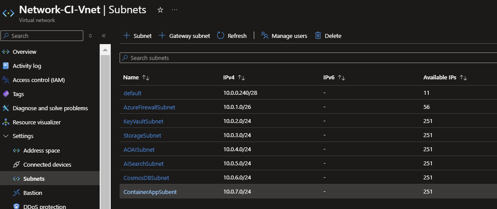
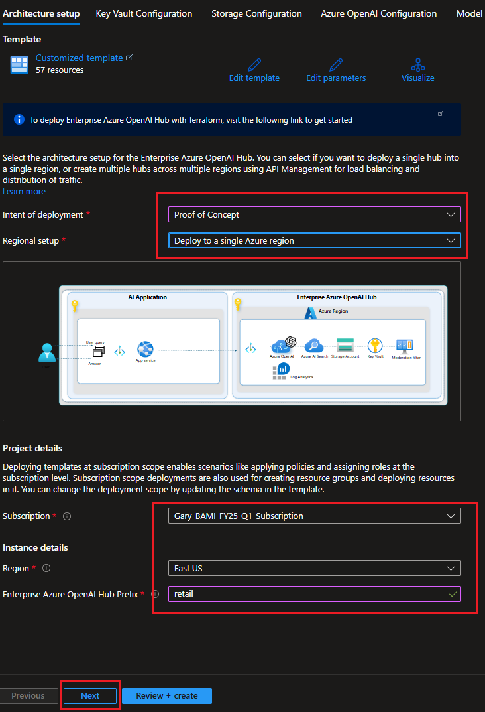
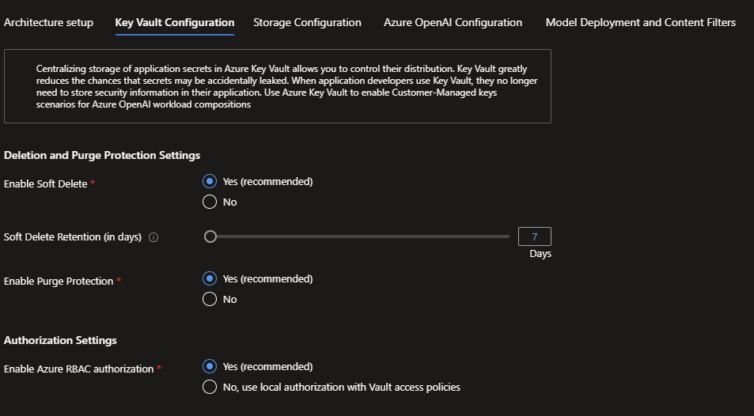
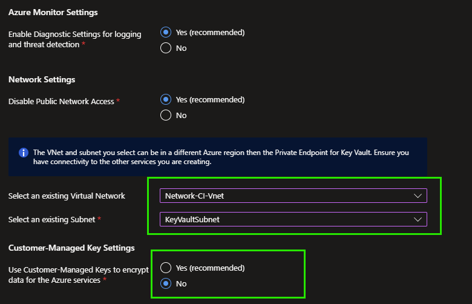
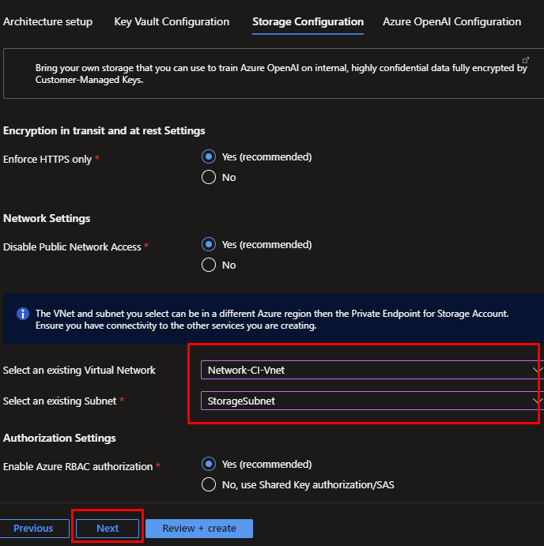
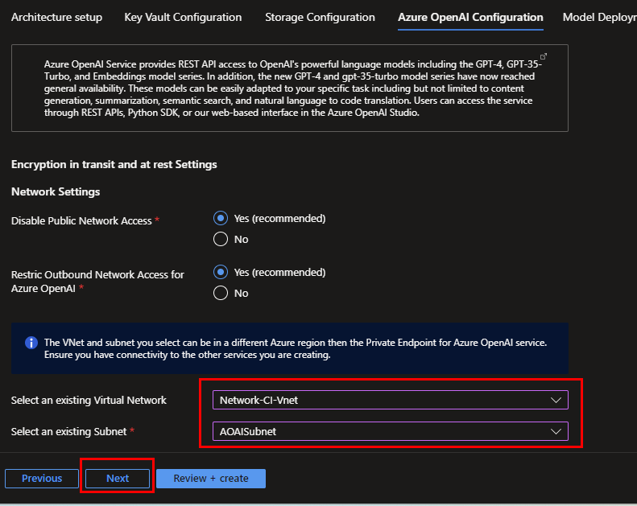

# Overview

This starter kit comes with API samples written in #CSharp language under the *api* folder. The sample data is under *data* folder. The quickstart specifically caters to E-Retail 

## Table of Contents

- [Resource Deployment](#resource-deployment--configurations)
  - [PoC Environment](#poc-environment) -> <Gary, Varma, Sam and Chris until 13th, September>
  - [Production Environment](#production-environment) -> <Gary, Varma, Sam and Chris for Guide Document until 27th, September>
    - [Bring your own Data](#bring-your-own-data)
    - [Using your existing Data Sources](#using-your-existing-data-sources)
    - [AI Search Configuration](#ai-search-configuration)
- [Use Cases](#use-cases) -> <Gary, Varma, Sam 27th, September>
  - [Keyword Search](#keyword-search)
  - [Vector Search](#vector-search)
  - [Semantic Re-ranking](#semantic-re-ranking)

## Resource Deployment & Configurations

### PoC Environment

**Pre-requisites**:For this POC deployment you will need a Virtual Network with 4 different subnets to cater to each of the following services:

1) KeyVault - To use for Key Vault Configuration tab
2) Storage Account - To use for Storage Configuration tab
3) Azure OpenAI - To use for Azure OpenAI Configurati0n tab
4) Azure AI Search, Azure Cosmos DB and Azure Container Apps - You may choose to create one subnet or 3 subnets for each of these services

The Virtual Network does not require to be in the same region where you are deploying the reference implementation, as the Private Endpoints can be in a different region compared to the Azure services that are created. However for ease of deployment we recommend you have a virtual network created in the same region. Here is what the subnet sample should looks like:

> :memo: **Note:** The subnet for Azure Container Apps should be a subnet that is not used by any other resources in the Virtual Network. It needs to have a minimum of 507 IP addresses available (/23) and Microsoft.App/environments need to be delegated.

> :bulb: **Tip:**: You may also choose the naming convention of 'prefix'-'region'-'resourcetype' where possible.

To deploy the E-Retail Quickstart kit in a PoC environment, follow these steps:

#### (1) Follow [this link](https://github.com/Gary3207Lee/ai-hub?tab=readme-ov-file#enterprise-azure-openai-hub-reference-implementation) for resource deployment and click deploy link as below

#### (2) Choose "Proof of Concept" with Single region option and type Azure OpenAI Hub Prefix for your resources as below

#### (3) Select your virtual network and subnet for the Key Vault resource, then select "No" for Customer-Managed Keys

#### (4) Select your virtual network and subnet for the Storage Account resource as below

#### (5) Select your virtual network and subnet for the Azure OpenAI resource as below

#### (6) Select "GPT4o" for your model and type deployment name and content filter name

#### (7) Select "Retail AI Enhanced Search" for the Use Case

Once this is selected you will find a few more options to configure below

#### (8) Select "Retail AI Enhanced Search" for the Use Case

#### (9) Select appropriate virtual network and subnet for Azure AI Search, Azure Cosmos DB and Azure Container Apps

For the purpose of POC we will use the subnet we created for Azure AI Search Service

### Production Environment

To deploy the E-Retail Quickstart kit in a production environment, follow these steps:

#### Bring your own Data

You can ingest your own data into the E-Retail Quickstart kit by following these steps:

#### Using your existing Data Sources

You can use your existing data sources with the E-Retail Quickstart kit by following these steps:

#### AI Search Configuration

Here is how you can configure the AI Search model in the E-Retail Quickstart kit:

## Use Cases

### Keyword Search

### Vector Search

### Semantic Re-ranking
