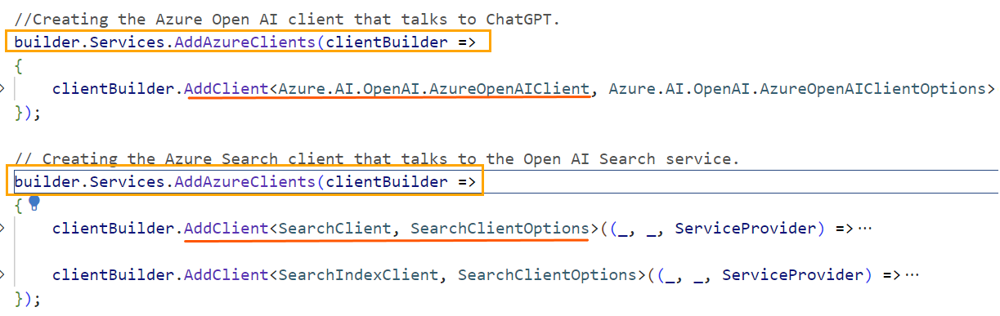
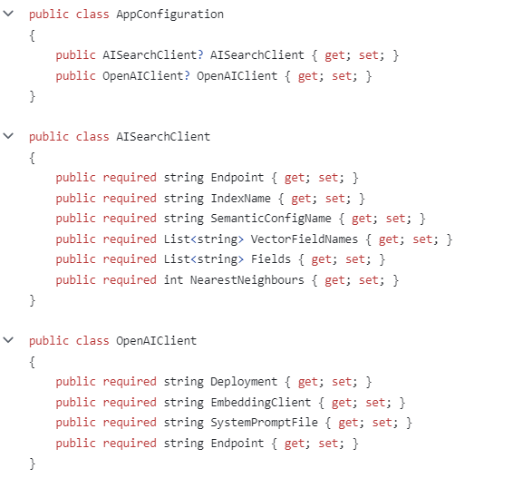
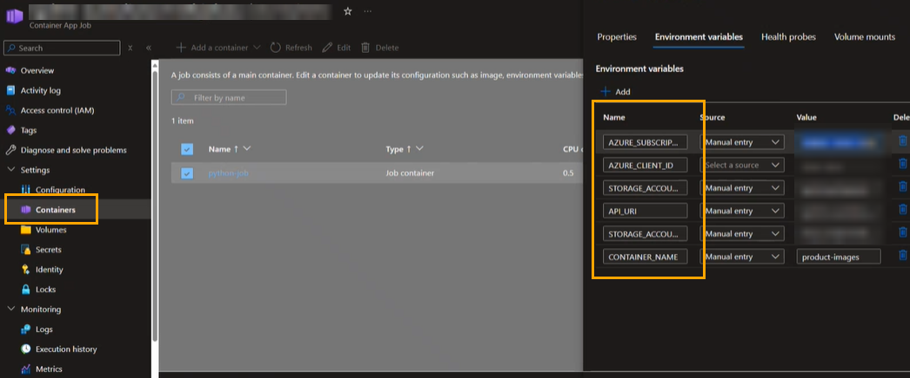

## What Program.CS file does

The spa folder contains the **frontend React code**. This runs as a **static web application**. It has an API connection to the container app. The **backend web API's** are in **.NET code** which run in the container app. This gets created with secrets which get auto-populated during deployment through the Bicep template. We inject the dependencies into the application using the Program.CS file.

### Step 1
When the application starts it uses the following definitions to call endpoints we create in the Backend scripts.

||
| ------ |

The endpoint definitions are taken from the [AppConfiguration class](/src/api/ProductSearchAPI/Models/AppConfiguration.cs). 

||
| ------ |

Essentially what's passed in to the environment variables of the container app gets bound to these fields.



The Endpoints are accessed using a [Default Azure Credential](https://learn.microsoft.com/python/api/azure-identity/azure.identity.defaultazurecredential?view=azure-python) from Azure Identity library.

### Step 2 -> IProductSearchService.cs

the **Program.cs** file make an implicit call to the **SearchProducts** method defined in [IProductSearchService.cs](/src/api/ProductSearchAPI/IProductSearchService.cs) file. The query that the user inputs for search is captured query variable. Along with query we pass several other parameters as shown below. 

```c#
{
    List<Product> products = await productService.SearchProducts(
     query,
     config.AISearchClient.SemanticConfigName,
     config.AISearchClient.VectorFieldNames,
     config.OpenAIClient.Deployment,
     config.AISearchClient.NearestNeighbours,
     config.OpenAIClient.SystemPromptFile,
     config.AISearchClient.Fields
 );
```
Within the [IProductSearchService.cs](/src/api/ProductSearchAPI/IProductSearchService.cs) file we can see that it calls the Endpoints. 

```c#
// Calling the Endpoints
        public ProductSearchService(ILogger<ProductSearchService> logger, SearchClient searchClient, SearchIndexClient searchIndexClient, AzureOpenAIClient openAIClient)
        {
            _logger = logger;
            _searchClient = searchClient;
            _searchIndexClient = searchIndexClient;
            _openAIClient = openAIClient;
        }
```

We also see references to the system_prompt.txt files

### Step 3 -> system_prompt.txt
We have the [system_prompt.txt](/src/api/ProductSearchAPI/system_prompt.txt) file that contains some system messages. A system message is a feature-specific set of instructions or contextual frameworks given to a generative AI model (e.g. GPT4-o, GPT3.5 Turbo, etc.) to direct and improve the quality and safety of a model’s output. This is particularly helpful in situations that need certain degrees of formality, technical language, or industry-specific terms.

$${\color{red} FOR PROD}$$

If its Production deployment you get the Open API Swagger endpoint is enabled, which means you get a way to test the API without having a GUI or you get a GUI in a web page. You don't need the spa

## Local Development
- Prerequisites
  - Azure Subscription
  -[Azure PowerShell](https://docs.microsoft.com/en-us/powershell/azure/install-az-ps)
  - Bash shell
  - [Git](https://git-scm.com/downloads)
  - [Azure CLI](https://docs.microsoft.com/en-us/cli/azure/install-azure-cli)
  - [VS Code](https://code.visualstudio.com/download)
  - [Node.js](https://nodejs.org/en/download/package-manager)
  - [Dotnet 8.0 Core](https://dotnet.microsoft.com/download)

1. Clone this repository to your local machine
2. Deploy base infrastructure using AI-Hub ARM templates
3. Compile & run the back-end API
   - Navigate to the '/api/ProductSearchAPI' folder
   - Rename ./api/ProductSearchAPI/appsettings.template to appsettings.json
   - Enter the required values in appsettings.json from the AI-Hib deployment output
   - Run `$ dotnet run`
   - The API will be running on `http://localhost:60872` or verify the port from the output of above command.
   - Logs can be viewed live in the VS Code Terminal
   - Test the API by searching for a product using the Swagger UI at `http://localhost:60872/swagger`
4. Open a new Terminal within VSCode and navigate to the '/spa' folder
   - Create a file named `/.env` & add a line with the following text
     - `REACT_APP_API_URL=http://localhost:60872`
   - Run `$ npm install`
   - Run `$ npm run dev`
   - Access the React application in a browser at `http://localhost:5173`
