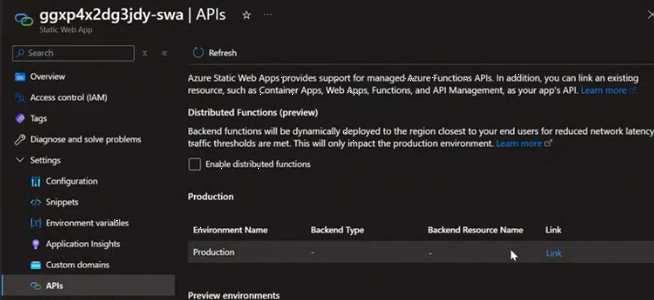
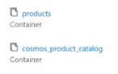

# Solution Guide & Explanation

## Workflow

The infrastructure components get deployed with a **Bicep template**.
The **backend web API's** are in **.NET code** which run in the container app. This gets created with secrets which get auto-populated during deployment through the Bicep template.

The spa folder contains the **frontend React code**. This runs as a **static web application**. It has an API connection to the container app.

The CosmosDB **Product** database gets created with a sample of 100 files and random images.
There is a **Product Catalog** inside the **Product** database. 

The AI search components consists of **Index** that searches the cosmosDB for certain fields and a Semantic configuration for generic searches. 

|| |
| ------ | ---- |

There is also the **Indexer** which shows the date when the CosmosDB was indexed.

|| |
| ------ | ---- |

**APIM** is public facing. The frontend is reactive in its layout. Furthermore it has paging and filters which let's you perform key value search. It can also cater to interactive search.

## Local Development

- Prerequisites
  - Azure Subscription
  -[Azure PowerShell](https://docs.microsoft.com/en-us/powershell/azure/install-az-ps)
  - Bash shell
  - [Git](https://git-scm.com/downloads)
  - [Azure CLI](https://docs.microsoft.com/en-us/cli/azure/install-azure-cli)
  - [VS Code](https://code.visualstudio.com/download)
  - [Node.js](https://nodejs.org/en/download/package-manager)
  - [Dotnet 8.0 Core](https://dotnet.microsoft.com/download)
  - [Key Concepts to Understand](./docs/01_Concepts.md)
  - [Solution Quickstart](./docs/02_Solution_Quickstart.md)

1. Clone this repository to your local machine
2. Deploy base infrastructure using AI-Hub ARM templates
3. Compile & run the back-end API
   - Navigate to the '/api/ProductSearchAPI' folder
   - Rename ./api/ProductSearchAPI/appsettings.template to appsettings.json
   - Enter the required values in appsettings.json from the AI-Hib deployment output
   - Run `$ dotnet run`
   - The API will be running on `http://localhost:60872` or verify the port from the output of above command.
   - Logs can be viewed live in the VS Code Terminal
   - Test the API by searching for a product using the Swagger UI at `http://localhost:60872/swagger`
4. Open a new Terminal within VSCode and navigate to the '/spa' folder
   - Create a file named `/.env` & add a line with the following text
     - `REACT_APP_API_URL=http://localhost:60872`
   - Run `$ npm install`
   - Run `$ npm run dev`
   - Access the React application in a browser at `http://localhost:5173`

