# Overview

This starter kit comes with API samples written in #CSharp language under the *api* folder. The sample data is under *data* folder. The quickstart specifically caters to E-Retail 

## Table of Contents

- [Workflow](#workflow)
- [Resource Deployment & Configurations](#resource-deployment--configurations)
  - [PoC Environment](#poc-environment)
  - [Production Environment](#production-environment)
    - [Bring your own Data](#bring-your-own-data)
    - [Using your existing Data Sources](#using-your-existing-data-sources)


## Resource Deployment & Configurations

### PoC Environment

**Pre-requisites**: For this POC deployment you will need a Virtual Network with a subnet that is not used by any other resources in the Virtual Network. It needs to have a minimum of 507 IP addresses available (/23) and Microsoft.App/environments need to be delegated.

| 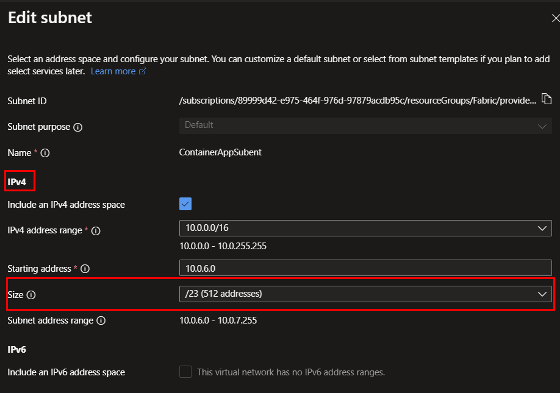 | 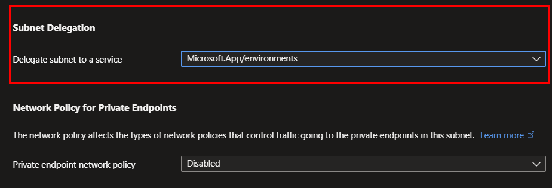|
| ----- | ------ |

Once configured the subnet configurations looks like this:
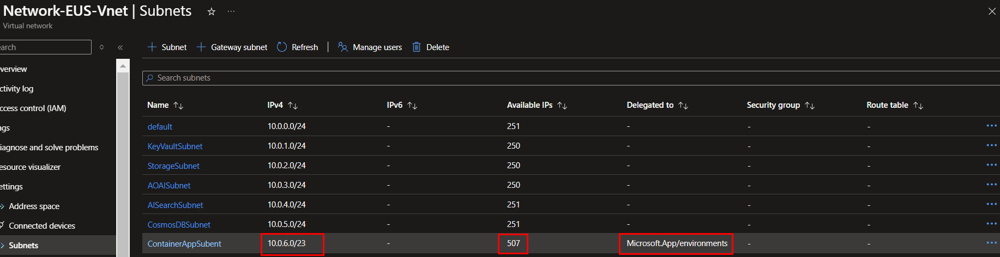

To deploy the E-Retail Quickstart kit in a PoC environment, follow these steps:

#### (1) Follow [this link](https://ms.portal.azure.com/#create/Microsoft.Template/uri/https%3A%2F%2Fraw.githubusercontent.com%2FIamVarma%2Fai-hub%2Fmain%2Finfrastructure%2Farm%2FaoaiArm.json/uiFormDefinitionUri/https%3A%2F%2Fraw.githubusercontent.com%2FIamVarma%2Fai-hub%2Fmain%2Finfrastructure%2Farm%2FEnterpriseAIPortal.json) for resource deployment and click deploy link as below

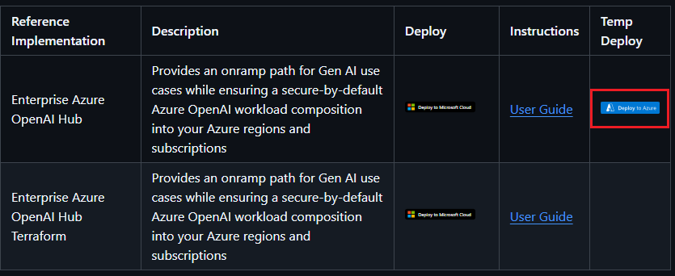

#### (2) Choose "Proof of Concept" with Single region option and type Azure OpenAI Hub Prefix for your resources as below

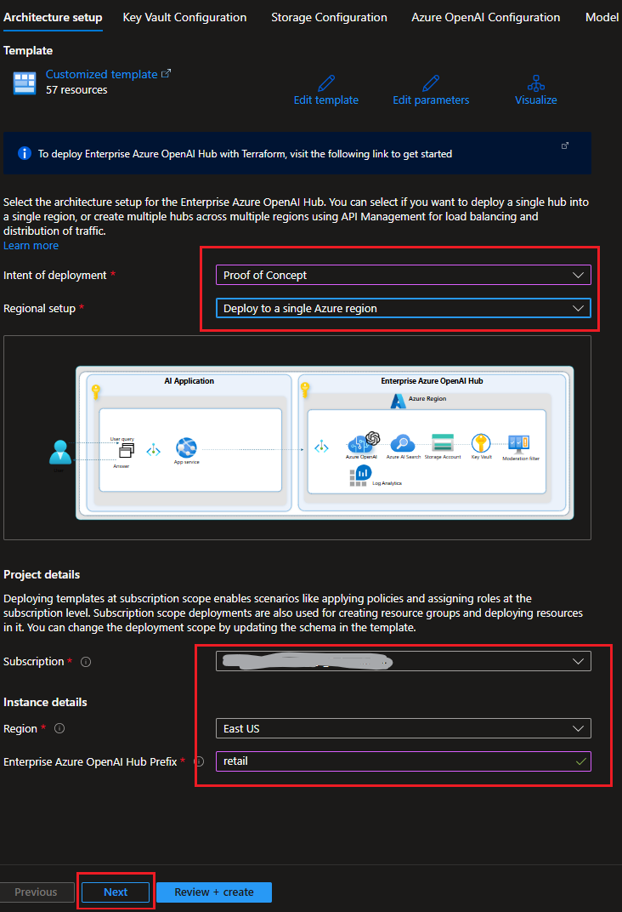

#### (3) Select your virtual network and subnet for the Key Vault resource, then select "No" for Customer-Managed Keys as shown below

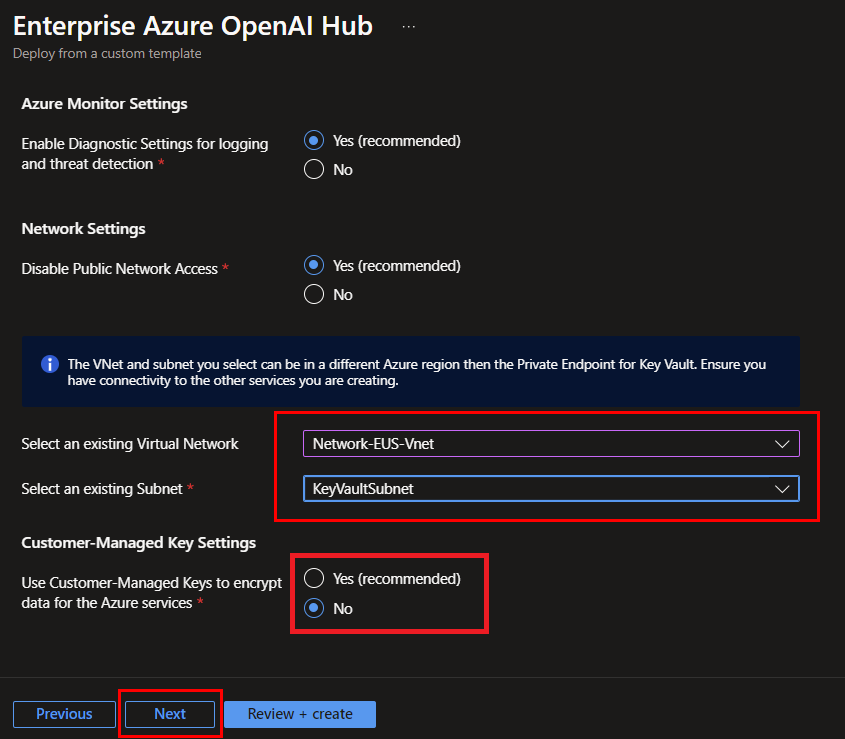

#### (4) Select your virtual network and subnet for the Storage Account resource as shown below

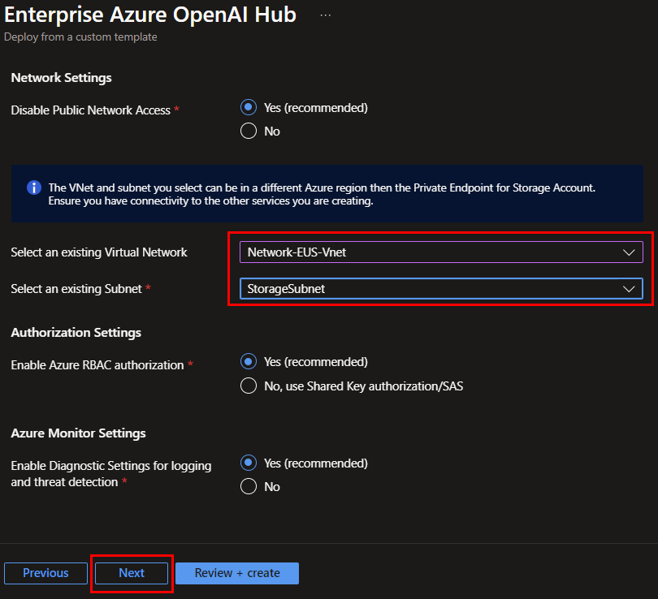

#### (5) Select your virtual network and subnet for the Azure OpenAI resource as shown below

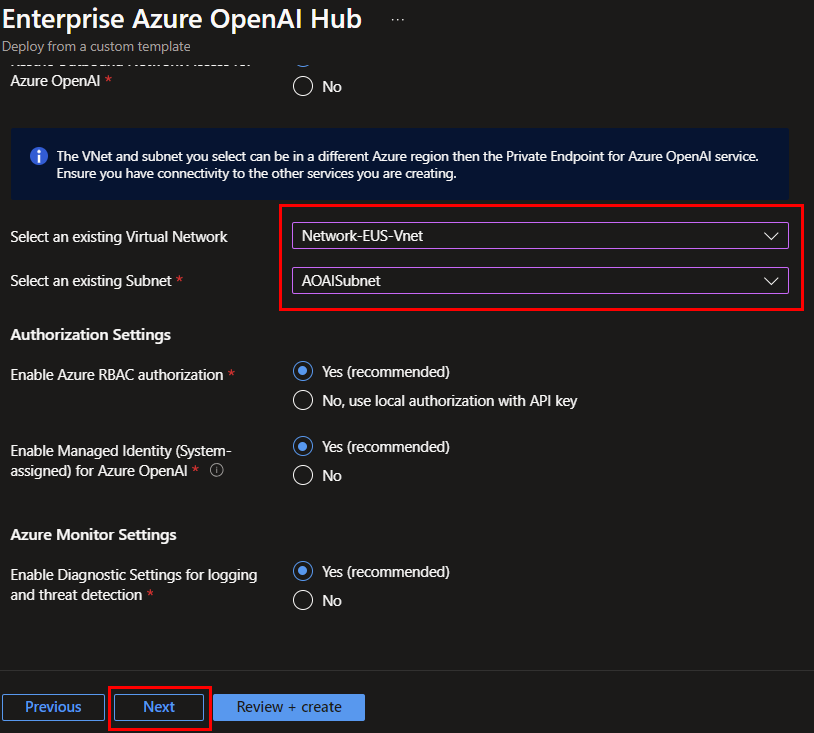

#### (6) Select "GPT4o" for your model and type deployment name and content filter name

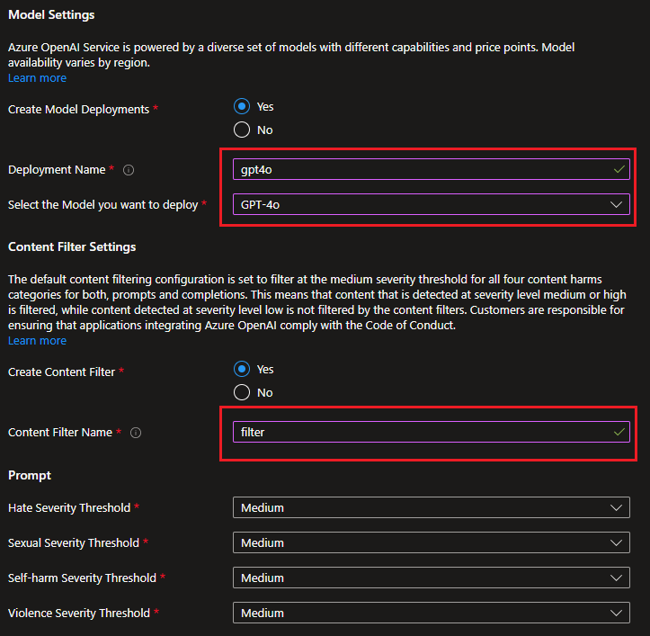

#### (7) Select "Retail AI Enhanced Search" for the Use Case

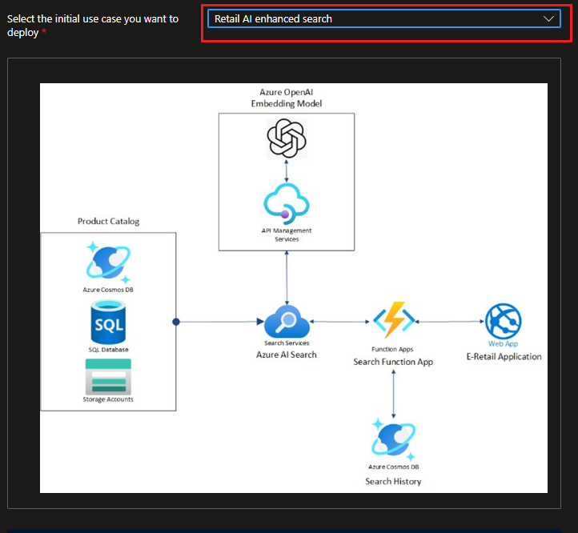

> :bulb: **Tip:**: Once this is selected you will find a few more options to configure options upon scrolling down further

#### (8) Select "Retail AI Enhanced Search" for the Use Case

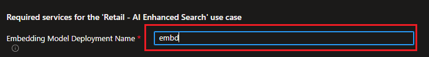

#### (9) Select appropriate virtual network and subnet for Azure AI Search as shown below

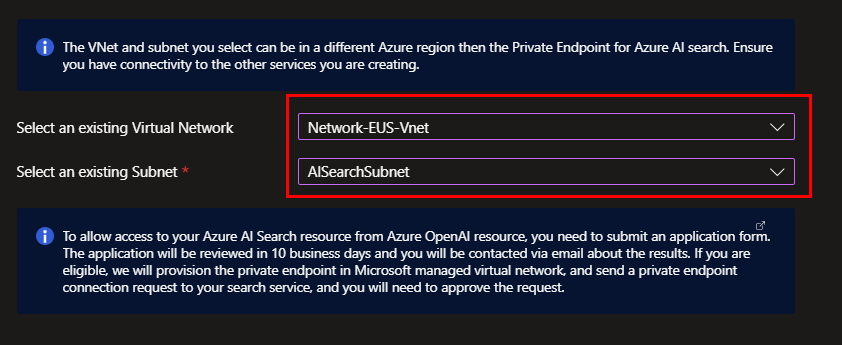

#### (10) Select appropriate virtual network and subnet for Azure Cosmos DB as shown below

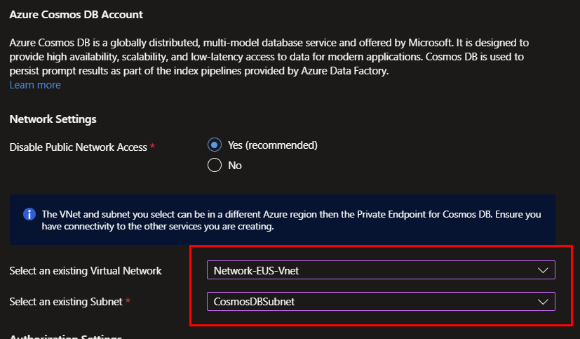

#### (11) Select appropriate virtual network and subnet for Azure Container Apps as shown below

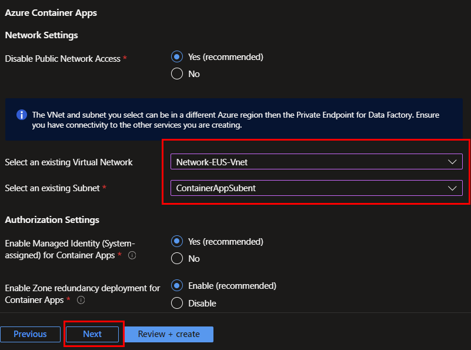

Finally you will be taken to the Review+Create  

#### (12) Approve the private endpoint connection for Azure OpenAI

Goes to the Azure OpenAI resource in Azure Portal and in the network settings, approve the private endpoint connection.

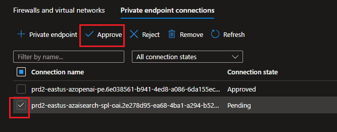

#### (13) Approve the private endpoint connection for Azure Cosmos DB

Goes to the Azure Cosmos DB resource in Azure Portal and in the network settings, approve the private endpoint connection.

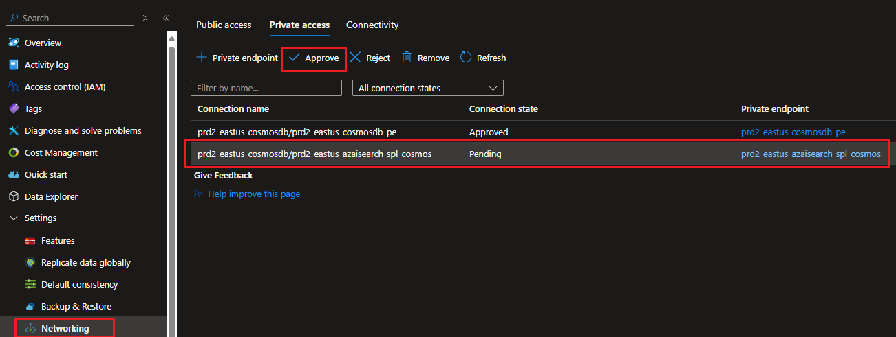

#### (14) Data Ingestion -> Run the job

Once the network approvals is done manually, Run the container job responsible for ingesting data in CosmosDB using Python script.

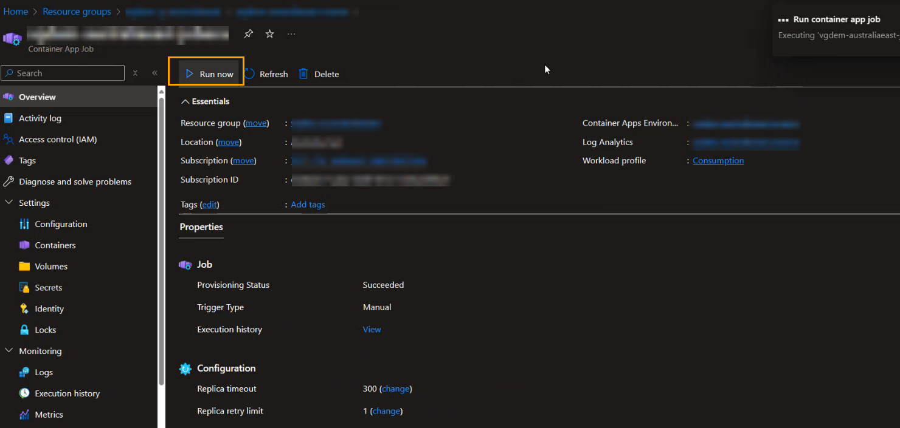

#### (15) CosmosDB Checks + AI Search Index, Indexer Checks

Usually it takes about a few seconds to succeed. Once succeeded you will be able to verify the loaded data navigating to the CosmosDB account -> Data Explorer

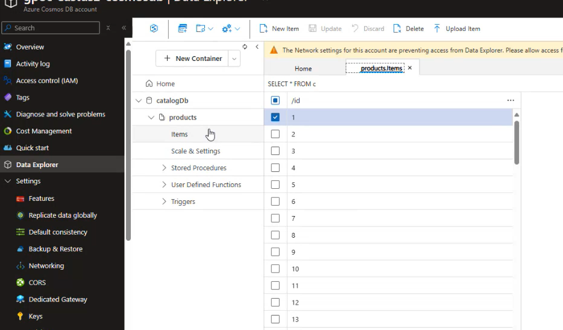

You should also be able to validate the AI Search Service reflecting an index created with random name and the indexer and the run for indexer

| |
| ----- | ----- |

| |
| ----- | ----- |


#### (16) Static Website Ingestion -> Run the job

#### (17) Static Website Checks


### Production Environment

**Pre-requisites**: For this Production deployment you will need a Virtual Network. Production deployment doesn't create container app so you don't need a Microsoft.App/environments need to be delegated subnet.

To deploy the E-Retail Quickstart kit in a production environment, follow the same steps as PoC deployment but you need to choose "Production" with Single region option.

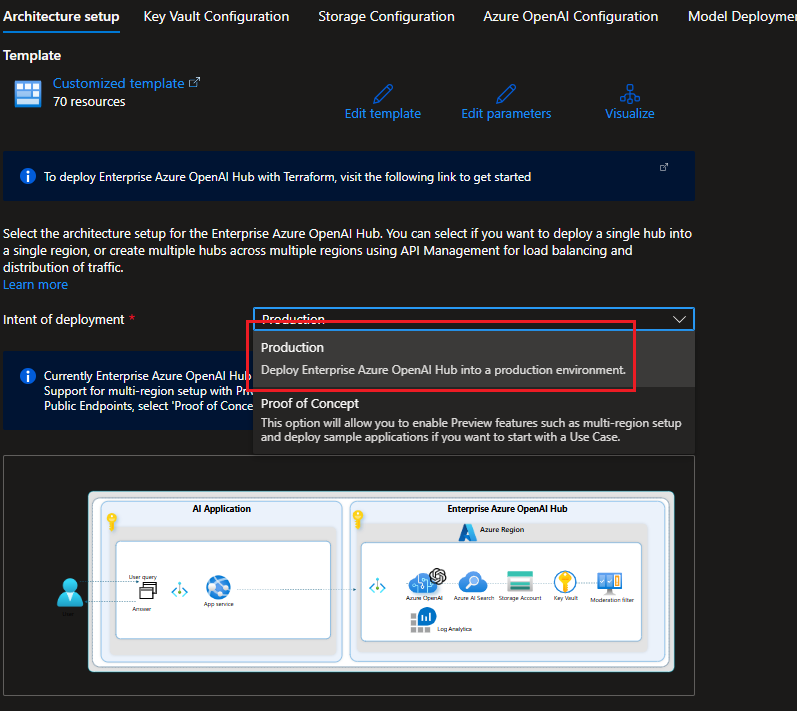

#### Bring your own Data

You can ingest your own data into the E-Retail Quickstart kit by following these steps:

##### (1) Please refer to the [guideline](../docs/02_DeploymentFlow.md) and you need to create .env file, modify [createIndex.py](../data/AzureSearch/createIndex.py) script and [config.json](../data/AzureSearch/config/config.json) file to ingest your own data

##### (2) Create .env file with the following content

```bash
COSMOS_ENDPOINT="https://XXXXXXXXXXXXXX-cosmosdb.documents.azure.com/"
COSMOS_DATABASE="catalogDb" - The name of the database in Cosmos DB
AZURE_SEARCH_ENDPOINT="https://XXXXXX-search1.search.windows.net"
COSMOS_DB_CONNECTION_STRING="ResourceId=/subscriptions/XXXXX/resourceGroups/XXXXXXXXXXXXXX/providers/Microsoft.DocumentDB/databaseAccounts/XXXXXX;Database=catalogDb;IdentityAuthType=AccessToken"
OPEN_AI_ENDPOINT="https://XXXXXX-openai.openai.azure.com/"
OPEN_AI_EMBEDDING_DEPLOYMENT_NAME = "embedding" - the deployment name of the Open AI Embedding model
AZURE_CLIENT_ID="" - The user managed identity of the Azure agent who is running the script ( E.g. VM or Azure container app job). If we are running the script in the local environment, we can leave it blank.
```

##### (3) Prepare your own data set with csv format and modify the line 406 in [createIndex.py](../data/AzureSearch/createIndex.py) script with your own csv data

```python
 products_df = pd.read_csv(f"{os.getcwd()}/AzureSearch/data/products.csv")
```

##### (4) Modify the line 6 in [config.json](../data/AzureSearch/config/config.json) script with approiate partition key based on your product catalog data structure

[How to choose the partition key for your Cosmos DB container](https://docs.microsoft.com/en-us/azure/cosmos-db/partitioning-overview#choose-a-partition-key)

```json
        "cosmos_db_partition_key" : "/id"
```

##### (5) Modify from the line 12 to 39 in [config.json](../data/AzureSearch/config/config.json) script based on your data structure and your search pattern

[Search Indexes in Azure AI Search](https://learn.microsoft.com/azure/search/search-what-is-an-index#field-attributes)

```json
        "search-index-config": {
            "name" : "contoso-product-index",
            "all_fields" : [
                {"field" :"id", "type": "string"},
                {"field": "name","type" :"string"},
                {"field": "price","type" :"double"},
                {"field": "category","type" :"string"},
                {"field": "brand","type" :"string"},
                {"field": "image","type" :"string"},
                {"field": "description","type" :"string"},
                {"field": "description_vectorized","type" :"vector"},
                {"field": "isDeleted","type" :"boolean"}
            ],
            "key_field" : "id",
            "retrievable_fields" : ["id","name","category","description","price","image","isDeleted","description_vectorized"],
            "filterable_fields" : ["name","category","brand","price"],
            "sortable_fields" : ["price"],
            "facetable_fields" : ["category","brand"],
            "searchable_fields" : ["name","description","category","description_vectorized"],
            "vector_fields" : ["description_vectorized"],
            "semantic_configurations": {
                "name": "product-semantic-config",
                "isEnabled": true,
                "title_field" : "name",
                "content_fields" : ["description"],
                "keyword_fields" : ["brand","category"]
            }
        },
```

#### Using your existing Data Sources

You can use your existing Cosmos DB data sources with the E-Retail Quickstart kit by following these steps:

##### (1) Please refer to the [guideline](../docs/02_DeploymentFlow.md) and you need to create .env file and need to modify [createIndex.py](../data/AzureSearch/createIndex.py) script file to ingest your own data from Cosmos DB

##### (2) Create .env file with the following contents

```bash
COSMOS_ENDPOINT="https://XXXXXXXXXXXXXX-cosmosdb.documents.azure.com/"
COSMOS_DATABASE="catalogDb" - The name of the database in Cosmos DB
AZURE_SEARCH_ENDPOINT="https://XXXXXX-search1.search.windows.net"
COSMOS_DB_CONNECTION_STRING="ResourceId=/subscriptions/XXXXX/resourceGroups/XXXXXXXXXXXXXX/providers/Microsoft.DocumentDB/databaseAccounts/XXXXXX;Database=catalogDb;IdentityAuthType=AccessToken"
OPEN_AI_ENDPOINT="https://XXXXXX-openai.openai.azure.com/"
OPEN_AI_EMBEDDING_DEPLOYMENT_NAME = "embedding" - the deployment name of the Open AI Embedding model
AZURE_CLIENT_ID="" - The user managed identity of the Azure agent who is running the script ( E.g. VM or Azure container app job). If we are running the script in the local environment, we can leave it blank.
```

##### (3) Modify the line from 44 to 86 in [createIndex.py](../data/AzureSearch/createIndex.py) script to create data source for your own Cosmos DB

```python
def create_data_source(
    service_endpoint: str,
    credential: DefaultAzureCredential,
    cosmos_db_container_name: str,
    azure_cosmosdb_resource_id_connection_string: str,
    search_indexer_data_source_name: str,
):

    # Indexing new and changed documents : https://learn.microsoft.com/en-us/azure/search/search-howto-index-cosmosdb#indexing-new-and-changed-documents
    # Soft delete and data change detection policies : https://learn.microsoft.com/en-us/azure/search/search-howto-index-cosmosdb#indexing-deleted-documents

    print(f"Creating data source: {search_indexer_data_source_name} in container: {cosmos_db_container_name} with connection string: {azure_cosmosdb_resource_id_connection_string}")

    try:
        ds_client = SearchIndexerClient(service_endpoint, credential)
        container = SearchIndexerDataContainer(name=cosmos_db_container_name)

        data_source_connection = SearchIndexerDataSourceConnection(
            name=search_indexer_data_source_name,
            type="cosmosdb",
            connection_string=azure_cosmosdb_resource_id_connection_string,
            container=container,
            data_change_detection_policy=HighWaterMarkChangeDetectionPolicy(
                odata_type="#Microsoft.Azure.Search.HighWaterMarkChangeDetectionPolicy",
                high_water_mark_column_name="_ts"
            ),
            data_deletion_detection_policy=SoftDeleteColumnDeletionDetectionPolicy(
                odata_type="#Microsoft.Azure.Search.SoftDeleteColumnDeletionDetectionPolicy",
                soft_delete_column_name="isDeleted",
                soft_delete_marker_value="true"
            ),
        )
    except Exception as error:
        print(f"Error occurred during indexer client creation: {error}")
        sys.exit(1)

    try:
        print(f"Creating data source connection: {search_indexer_data_source_name}")
        data_source = ds_client.create_or_update_data_source_connection(data_source_connection)
        return data_source
    except Exception as error:
        print(f"Error occurred during data source creation: {error}")
        sys.exit(1)

```

> :bulb: **Tip:**: You can apply CRUD change (Delta Copy) from Cosmos DB to AI Search. For this, you can utilize osft delete field with timestamp (_ts) for high water mark. </br>
[Indexing new and changed documents](https://learn.microsoft.com/azure/search/search-howto-index-cosmosdb#indexing-new-and-changed-documents) </br>
[Soft delete and data change detection policies](https://learn.microsoft.com/azure/search/search-howto-index-cosmosdb#indexing-deleted-documents)

You can refer to the guideline [here](https://learn.microsoft.com/azure/search/search-howto-index-cosmosdb) for more information on how to index Cosmos DB data.
