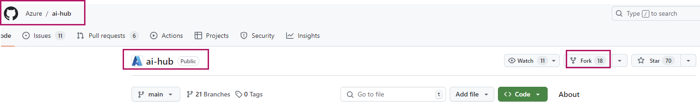
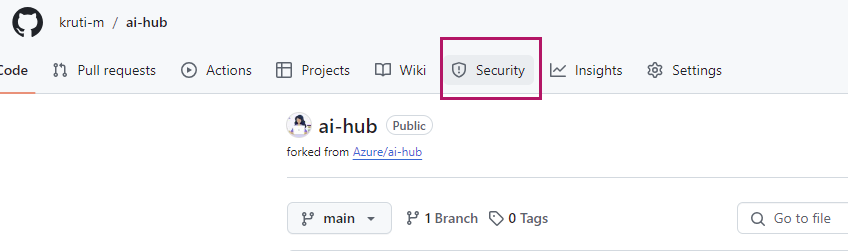

# Security Guide & Best Practices

This document provides guidance on how to secure the solution and best practices to follow.

$${\color{blue} FOR POC}$$

From POC prespective the security considerations are taken care of through the ARM template deployment itself. Calling out the important ones :

* [Default Azure Credential](https://learn.microsoft.com/python/api/azure-identity/azure.identity.defaultazurecredential?view=azure-python) : The frontend and backend codes are deployed using Default Azure Credentials from Azure Identity eliminating the need to map or manage individual user/s.

* [RBAC Permission](https://learn.microsoft.com/azure/role-based-access-control/role-assignments-template) : ARM template also takes care of the permissions required for the various components like CosmosDB, Azure Search, Open AI and Static Website to interact with each other without any manual intervention.

* [Private Endpoints for services](https://learn.microsoft.com/azure/private-link/private-endpoint-overview): While the POC does not restrict you but its better to **deploy it as is** so that the communication between these services happen via private endpoint. Explicit approval are required during deployment to enable the same **[Steps 12-13 in Quickstart]**. The private link is created for the outbound connectivity from the Azure AI Search to the Cosmos DB, and Azure AI Search to the Azure Open AI Service. The only public endpoint that gets enabled is for the Static Website **[Step 16 in Quickstart]**.

* [Cleanup for POC](https://learn.microsoft.com/azure/cloud-adoption-framework/scenarios/cloud-scale-analytics/tutorials/cleanup-instructions) : Once tested ensure you leverage the [Cleanup Guide for POC](06_CleanupPOCResources.md) to clean an unwanted resources in your subscription

$${\color{red} FOR PROD}$$

The expectation is customers would have forked the **ai-hub** Public repository for production deployment in their environment.

 

## Step 1: Security tab of repository

Once in your forked repository go to the **Security** tab.

## Step 2: Validate security options

There are various defualt options provided in the repository which you can enable. Recommendation is to have all the Security options that you see under security Overview enabled.

You can also enable alerting in the left hand side panel.

**Dependabot** : Dependabot alerts tell you when your code depends on a package that is insecure. Often, software is built using open-source code packages from a large variety of sources.you may unknowingly be using dependencies that have security flaws, also known as vulnerabilities.Dependabot performs a scan of the default branch of your repository to detect insecure dependencies, and sends Dependabot alerts. 

> :bulb: **For More Information**: [About Dependabot alerts](https://docs.github.com/code-security/dependabot/dependabot-alerts/about-dependabot-alerts#dependabot-alerts-for-vulnerable-dependencies) [About Dependabot auto-triage rules](https://docs.github.com/code-security/dependabot/dependabot-auto-triage-rules/about-dependabot-auto-triage-rules)

**Code-scanning** : Code scanning leverages a third-party tool CodeQL analysis workflow to identify vulnerabilities and errors in the code stored in your repository. By default this is disabled. You manually have to Configure and Enable it.

| | |
| ------ | ------ |

### Reference Templates

* [GitHub Security Lab](https://securitylab.github.com/)
* [Quickstart for securing your repository](https://docs.github.com/code-security/getting-started/quickstart-for-securing-your-repository)