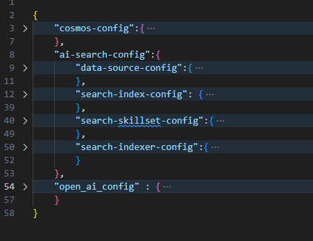
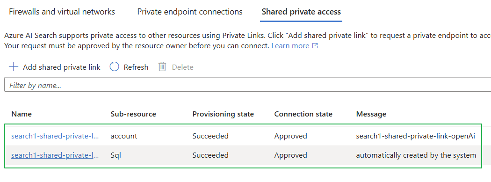

# Data Ingestion And Azure Search Metadata creation

## objective
In this example, we will upload sample data into Cosmos DB and create an index in Azure AI Search to scan the data from Cosmos DB. While creating the Azure AI Search Index, we will also set up other associated resources such as Skillset, Indexer, Data Source, and Vectorizer. The below guidance will focus on the local development through VS Code.

## Prerequisites

1. You already have an Active Azure Subscription.
2. You have a python virtual environment where the required modules are already installed (requirements.txt). If you do not have the virtual environment, you can create one using the below command.

```bash
python -m venv < virtual environment name>
```
3. Install the packages that are required to run the script. You can install the packages using the below command.

```bash 
pip install -r requirements.txt
```

## Azure Service Requirements

    - Azure Cosmos DB
    - Azure AI Search
    - Azure Open AI

## configurations

We have two configurations files to update for Local Debugging.  

### .env file

- **COSMOS_ENDPOINT**="https://XXXXXXXXXXXXXX-cosmosdb.documents.azure.com/"
- **COSMOS_DATABASE**="catalogDb" - The name of the database in Cosmos DB
- **AZURE_SEARCH_ENDPOINT**="https://XXXXXX-search1.search.windows.net"
- **COSMOS_DB_CONNECTION_STRING**="ResourceId=/subscriptions/XXXXX/resourceGroups/XXXXXXXXXXXXXX/providers/Microsoft.DocumentDB/databaseAccounts/XXXXXX;Database=catalogDb;IdentityAuthType=AccessToken"
- **OPEN_AI_ENDPOINT**="https://XXXXXX-openai.openai.azure.com/"
- **OPEN_AI_EMBEDDING_DEPLOYMENT_NAME** = "embedding" - the deployment name of the Open AI Embedding model
- **AZURE_CLIENT_ID**="" - The user managed identity of the Azure agent who is running the script ( E.g. VM or Azure container app job). If we are running the script in the local environment, we can leave it blank.

### Search Config

`AzureSearch\config\config.json`



- **Cosmos config** : this portion contains the cosmos db configurations like cosmos db name, container name, partition key, and the fields which we want to index.
- **Search config** : This portion contains the Azure AI Search configurations like search service name, index name, indexer name, skillset name, and the fields which we want to index.
- **Open AI config** : This portion contains the Open AI configurations like open ai endpoint, model deployment name.

## RBAC permission required

-  **Cosmos DB**
    - [Cosmos DB Data Contributor Role](https://learn.microsoft.com/en-us/azure/cosmos-db/how-to-setup-rbac#built-in-role-definitions) 
        - For the _Agent_ who is running the script. If we are running it from the Local environment, then our Object ID needs to have access to the Cosmos DB. If we are running it from Azure VM or Azure Container App, then the VM or Container App Managed Identity needs to have access to the Cosmos DB.
    - [Cosmos DB Data Reader Role](https://learn.microsoft.com/en-us/azure/cosmos-db/how-to-setup-rbac#built-in-role-definitions)
        - For the _Azure AI Search managed Identity_
    - Cosmos DB Account Reader Role (roleDefinitionId: `fbdf93bf-df7d-467e-a4d2-9458aa1360c8`)
        - For the _Azure AI Search managed Identity_
- **Azure AI Search**
    - Search Service Contributor (roleDefinitionId: `7ca78c08-252a-4471-8644-bb5ff32d4ba0`)
        - The _agent_ who is running the script. If we are running it from the Local environment, then our Object ID needs to have access to the Azure AI Search. If we are running it from Azure VM or Azure Container App, then the_ VM or Container App Managed Identity_ needs to have access to the Azure AI Search.
        
- **Azure Open AI**
    - Azure AI Developer Role ( roleDefinitionId: `64702f94-c441-49e6-a78b-ef80e0188fee`)
        - This is needed for the _Azure AI Search managed identity_ to access the Open AI Embedding model.

To provide access to the Cosmos DB data Reader role and Cosmos DB Data Contributor Role, we can use the below code in the script. This code will assign the required roles to the Azure AI Search managed identity.

```powershell
$readOnlyRoleDefinitionId = "00000000-0000-0000-0000-000000000002" # Cosmos DB Data Contributor Role
#$readOnlyRoleDefinitionId = "00000000-0000-0000-0000-000000000001" #- Cosmos DB Data Reader Role

$principalId="<object ID of the Agent/Client ID>"
$ResourceGroupName="< Resource Group name>"
$accountName="< Cosmos DB Account Name>"

# check if the role is present
$roleAssignment = Get-AzCosmosDBSqlRoleAssignment -AccountName $accountName -ResourceGroupName $resourceGroupName | Where-Object { $_.PrincipalId -eq $principalId -and $_.RoleDefinitionId -match $readOnlyRoleDefinitionId }
if (!$roleAssignment) {
    Write-Output "Assigning role to the service principal"
    New-AzCosmosDBSqlRoleAssignment -AccountName $accountName -ResourceGroupName $resourceGroupName -RoleDefinitionId $readOnlyRoleDefinitionId -Scope "/" -PrincipalId $principalId  
}

```
## Network configurations

Please ignore this section if you the services in the public endpoint. If you are using the private endpoint for the network connectivity between the resources make sure that the below configurations are done.
1. You are using the Azure AI Search service with SKU Standard2 or above. This is required because we are using the AI Enrichment and skills in the Azure AI Search. [[details](https://learn.microsoft.com/en-us/azure/search/search-indexer-howto-access-private?tabs=portal-create#prerequisites)]
2. The private Link is created for the outbound connectivity from the Azure AI Search to the Cosmos DB, and Azure AI Search to the Azure Open AI Service. [[details](https://learn.microsoft.com/en-us/azure/search/search-indexer-howto-access-private?tabs=portal-create#supported-resource-types)]


## Running the script

If we are running the script in the local environment, we can run the script using the below command.

```bash
python data\AzureSearch\createIndex.py
```

The script does the following high level steps. 

1. Read the configurations from the `config.json` file.
2. Read the environment variables from the `.env` file.
3. Create the Cosmos DB client and upload the data to the Cosmos DB container from the file `data\AzureSearch\data\products.csv`.
4. Create the Azure AI Search client and create the Azure AI Search artifacts.
5. creating the Azure AI Search Data Source pointing to the Cosmos DB container. This uses the managed identity of Azure Search for the authentication. 
6. creating the Azure AI Search Index. The Index definition is created based on the fields mentioned in the `config.json` file. We also create [Vectorizer](https://learn.microsoft.com/en-us/azure/search/vector-search-how-to-configure-vectorizer) and enable [Semantic Configurations](https://learn.microsoft.com/en-us/azure/search/semantic-how-to-configure?tabs=portal) based on the configurations mentioned in the config file.
7. creating the Azure AI Search Skillset. This skillset uses the Open AI Embedding model to enrich the data. The Open AI Embedding model is used to get the embeddings of the text data. The embeddings are used to improve the search relevance.
8. creating the Azure AI Search Indexer. The indexer is used to scan the data from the Cosmos DB and push the data to the Azure AI Search Index. 


